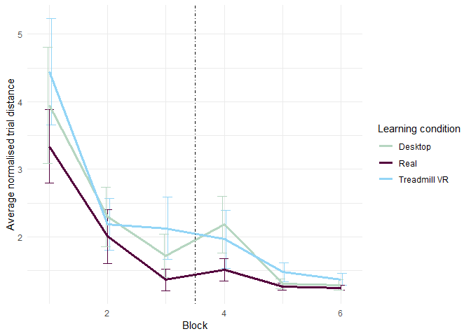
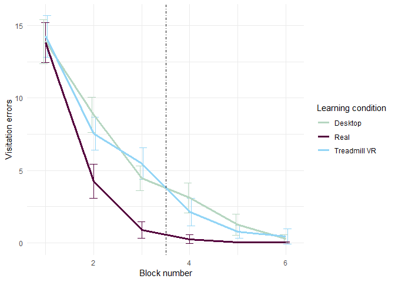

Transfer report
================
Lukáš Hejtmánek
9 August 2018

We hypothesized that the degree of transfer to the real-world building would vary as a function of immersion. As a first test of this issue, we wished to determine whether all modalities resulted in some degree of transfer. Data for distance walked and number of door visitation errors were each entered into a 3 (Learning Condition: real, desktop, treadmill VR) × 2 (Block: block 1, block 4) mixed-model analysis of variance (ANOVA). For distance walked, there was a main effect for Learning Condition, *F*(2, 57)=4.79, *M**S**E* = 1.94, *p* = .012. There was a also a main effect for Block, *F*(1, 57)=59.88, *M**S**E* = 1.78, *p* &lt; .001. The Learning Condition by Block interaction effect did not reach significance *F*(2, 57)=0.97, *M**S**E* = 1.78, *p* = .386. Follow-up comparisons showed that for walked distance all three modalities showed an improvement from block 1 (first exposure to the modality) to block 4 (first exposure to the real building for immersed/impoverished conditions, fourth exposure for real-world). Descriptive and inferential statistics for these comparisons are shown in Table X and Table X+1 for distance and errors, respectively.

For visitation errors, there was no main effect for Learning Condition,*F*(2, 58)=2.45, *M**S**E* = 10.08, *p* = .095. There was a main effect for Block, *F*(1, 58)=520.43, *M**S**E* = 8.75, *p* &lt; .001. The Learning Condition by Block interaction effect did not reach significance, *F*(2, 58)=2.26, *M**S**E* = 8.75, *p* = .113. Follow-up comparisons showed that all three modalities showed an improvement in visitation errors from block 1 (first exposure to the modality) to block 4 (first exposure to the real building for immersed/impoverished conditions, fourth exposure for real-world). Descriptive and inferential statistics for these comparisons are shown in Table X+1.

#### TABLES

| learning.condition | exp\_block\_id |     M|    Sd|
|:-------------------|:---------------|-----:|-----:|
| Desktop            | 1              |  3.95|  4.65|
| Desktop            | 4              |  2.18|  2.02|
| Real               | 1              |  3.34|  2.69|
| Real               | 4              |  1.51|  0.87|
| Treadmill VR       | 1              |  4.44|  4.26|
| Treadmill VR       | 4              |  1.96|  2.09|

| condition    |  Mdiff|   df|     t| p           |     d| CI         |
|:-------------|------:|----:|-----:|:------------|-----:|:-----------|
| Real         |   1.78|   20|  6.13| p &lt; .001 |  1.34| 1.18, 2.39 |
| Desktop      |   1.52|   18|  3.30| p &lt; .001 |  0.76| 0.55, 2.49 |
| Treadmill VR |   2.34|   19|  4.68| p &lt; .001 |  1.05| 1.29, 3.39 |

| learning.condition | exp\_block\_id |      M|    Sd|
|:-------------------|:---------------|------:|-----:|
| Desktop            | 1              |  13.89|  8.17|
| Desktop            | 4              |   3.11|  5.62|
| Real               | 1              |  13.82|  8.05|
| Real               | 4              |   0.27|  1.70|
| Treadmill VR       | 1              |  14.25|  7.88|
| Treadmill VR       | 4              |   2.13|  5.22|

| condition    |  Mdiff|   df|      t| p           |     d| CI           |
|:-------------|------:|----:|------:|:------------|-----:|:-------------|
| Real         |  13.55|   21|  16.87| p &lt; .001 |  3.60| 11.88, 15.22 |
| Desktop      |  10.77|   18|   8.72| p &lt; .001 |  2.00| 8.18, 13.37  |
| Treadmill VR |  12.12|   19|  16.96| p &lt; .001 |  3.79| 10.62, 13.61 |

Figure X shows the time course of each learning condition over the 6 blocks of exposure to the environments, in terms of walked distance and visitation errors over the course of the experiment. As can be seen in Figure XX, all modalities showed an incremental improvement in terms of both distance and visitation errors (see fig. XXX and fig. XXX). At block 4, however, an uptick can be observed for the desktop modality switch group and slight for no modality switch (i.e. real to real).
To better quantify these effects, we took two different approaches. First, we analyzed the slope of the learning curves from phase 1 (blocks 1-3) and compared between different Learning Conditions.

 Figure X. Performance of each learning condition across time is shown for average normalized distance (a) and visitation errors (b). Vertical, dashed line indicates when the second phase of testing (always in the real world) began. Error bars represent \[95% CI’s\].

Quantifying what happens before transfer
----------------------------------------

To better understand the effect of modality (i.e., real world vs. treadmill VR vs. desktop), we assessed the change in walked distance and visitation errors prior to transfer.

Mixed-effect models revealed a main effect of block on distance performance, suggesting that participants improved their paths in all three conditions, F(DFn, DFd) = \#\#.\#\#, p = .\#\#\#. The interaction effect with modality was not significant , F(DFn, DFd) = \#\#.\#\#, p = .\#\#\#, suggesting that learning rate did not differ as a function of modality. In contrast, for visitation errors, we again found a main effect of block but, importantly, a block X modality interaction effect. This finding suggested that visitation errors improved differently as a function of modality.

### Tables?

For the last block of learning (block 3), we conducted separate one-way ANOVAs to compare learning conditions for walked distance and visitation errors. There were a main effects of for both walked distance, *F*(2, 315)=4.18, *M**S**E* = 3.54, *p* = .016, and visitation errors, *F*(2, 363)=32.63, *M**S**E* = 22.37, *p* &lt; .001).

We also observed significant differences between conditions in pointing performance at the end of the first phase, *F*(2, 729)=17.78, *M**S**E* = 1, 412.53, *p* &lt; .001. Specifically, participants in the real-world learning group (M = 21.93 , SD = 26.34) performed significantly better compared to both the immersive VR group (M = 35.23 , SD = 37.48), *t*(424.16)= − 4.57, *p* &lt; .001, and the desktop group (M = 41.62 , SD = 47.47), *t*(342.85)=5.57, *p* &lt; .001. Overall, these findings suggested that participants learned the building the best as a result of real-world navigation, followed by the immersive condition, with the desktop condition showing the slowest acquisition.

Quantifying what happens after/during? transfer
-----------------------------------------------

We next considered the effects of transferring from either the treadmill or desktop to the real-world building compared with continuing to navigate the real-world building. We did this by directly comparing walked distance and visitation errors on block 3 (the last block before the transfer phase) with the first block of the transfer phase (block 4). Data for distance walked and number of door visitation errors were each entered into a 3 (Learning Condition: real, desktop, treadmill VR) × 2 (Block: block 1, block 4) mixed-model ANOVA. For visitation errors, there was a (was no) main effect for Learning Condition, F(DFn, DFd) = \#\#.\#\#, p = .\#\#\#. There was a (was no) main effect for Block, F(DFn, DFd) = \#\#.\#\#, p = .\#\#\#. The Learning Condition by Block interaction effect was significant (did not reach significance), F(DFn, DFd) = \#\#.\#\#, p = .\#\#\#. For walked distance, there was no main effect of Learning Condition, F(DFn, DFd) = \#\#.\#\#, p = .\#\#\#, or Block, F(DFn, DFd) = \#\#.\#\#, p = .\#\#\#, and the interaction also failed to reach significance, , F(DFn, DFd) = \#\#.\#\#, p = .\#\#\# (See table XXX).
