Transfer report
================
Lukáš Hejtmánek
9 August 2018

Participants
------------

| condition |   no|  yes|  percent|
|:----------|----:|----:|--------:|
| real-real |    1|   23|     0.96|
| ve-real   |    2|   20|     0.91|
| vr-real   |   15|   21|     0.58|

A total of 82 undergraduate students at UC Davis (M = 20.422 , SD = 2.159) particiapted in the study in exchange for a study credit. 18 participants didn't finish due to motion sickness and 3 were removed due to a technical failure of the real world tracking systen. Only 58 percent the students being able to finish Treadmill VR learning condition.

We hypothesized that the degree of transfer to the real-world building would vary as a function of immersion. As a first test of this issue, we wished to determine whether all modalities resulted in some degree of transfer. Data for distance walked and number of door visitation errors were each entered into a 3 (Learning Condition: real, desktop, treadmill VR) × 2 (Block: block 1, block 4) mixed-model analysis of variance (ANOVA). For distance walked, there was a main effect for Learning Condition, *F*(2, 57)=4.79, *M**S**E* = 1.94, *p* = .012. There was a also a main effect for Block, *F*(1, 57)=59.88, *M**S**E* = 1.78, *p* &lt; .001. The Learning Condition by Block interaction effect did not reach significance *F*(2, 57)=0.97, *M**S**E* = 1.78, *p* = .386. Follow-up comparisons showed that for walked distance all three modalities showed an improvement from block 1 (first exposure to the modality) to block 4 (first exposure to the real building for immersed/impoverished conditions, fourth exposure for real-world). Descriptive and inferential statistics for these comparisons are shown in Table X and Table X+1 for distance and errors, respectively.

For visitation errors, there was no main effect for Learning Condition,*F*(2, 58)=2.45, *M**S**E* = 10.08, *p* = .095. There was a main effect for Block, *F*(1, 58)=520.43, *M**S**E* = 8.75, *p* &lt; .001. The Learning Condition by Block interaction effect did not reach significance, *F*(2, 58)=2.26, *M**S**E* = 8.75, *p* = .113. Follow-up comparisons showed that all three modalities showed an improvement in visitation errors from block 1 (first exposure to the modality) to block 4 (first exposure to the real building for immersed/impoverished conditions, fourth exposure for real-world). Descriptive and inferential statistics for these comparisons are shown in Table X+1.

| learning.condition | exp\_block\_id |     M|    Sd|
|:-------------------|:---------------|-----:|-----:|
| Desktop            | 1              |  3.95|  4.65|
| Desktop            | 4              |  2.18|  2.02|
| Real               | 1              |  3.34|  2.69|
| Real               | 4              |  1.51|  0.87|
| Treadmill VR       | 1              |  4.44|  4.26|
| Treadmill VR       | 4              |  1.96|  2.09|

| condition    |  Mdiff|   df|     t| p           |     d| CI         |
|:-------------|------:|----:|-----:|:------------|-----:|:-----------|
| Real         |   1.78|   20|  6.13| p &lt; .001 |  1.34| 1.18, 2.39 |
| Desktop      |   1.52|   18|  3.30| p &lt; .001 |  0.76| 0.55, 2.49 |
| Treadmill VR |   2.34|   19|  4.68| p &lt; .001 |  1.05| 1.29, 3.39 |

| learning.condition | exp\_block\_id |      M|    Sd|
|:-------------------|:---------------|------:|-----:|
| Desktop            | 1              |  13.89|  8.17|
| Desktop            | 4              |   3.11|  5.62|
| Real               | 1              |  13.82|  8.05|
| Real               | 4              |   0.27|  1.70|
| Treadmill VR       | 1              |  14.25|  7.88|
| Treadmill VR       | 4              |   2.13|  5.22|

| condition    |  Mdiff|   df|      t| p           |     d| CI           |
|:-------------|------:|----:|------:|:------------|-----:|:-------------|
| Real         |  13.55|   21|  16.87| p &lt; .001 |  3.60| 11.88, 15.22 |
| Desktop      |  10.77|   18|   8.72| p &lt; .001 |  2.00| 8.18, 13.37  |
| Treadmill VR |  12.12|   19|  16.96| p &lt; .001 |  3.79| 10.62, 13.61 |

Figure X shows the time course of each learning condition over the 6 blocks of exposure to the environments, in terms of walked distance and visitation errors over the course of the experiment. As can be seen in Figure XX, all modalities showed an incremental improvement in terms of both distance and visitation errors (see fig. XXX and fig. XXX). At block 4, however, an uptick can be observed for the desktop modality switch group and slight for no modality switch (i.e. real to real).
To better quantify these effects, we took two different approaches. First, we analyzed the slope of the learning curves from phase 1 (blocks 1-3) and compared between different Learning Conditions.

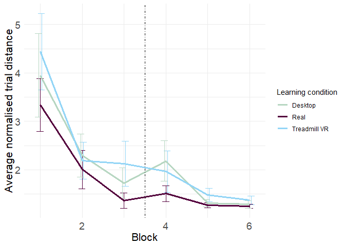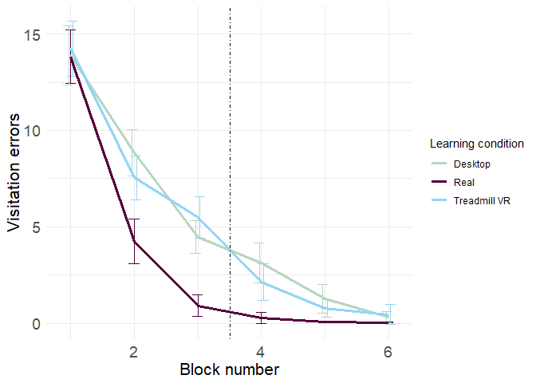

Figure X. Performance of each learning condition across time is shown for average normalized distance (a) and visitation errors (b). Vertical, dashed line indicates when the second phase of testing (always in the real world) began. Error bars represent \[95% CI’s\].

Quantifying what happens before transfer
----------------------------------------

To better understand the effect of modality (i.e., real world vs. treadmill VR vs. desktop), we assessed the change in walked distance and visitation errors prior to transfer from block 1 to block 3.

3x2 repeated measures ANOVA revealed a main effect of block on distance performance *F*(1, 57)=92.06, *M**S**E* = 1.51, *p* &lt; .001, suggesting that participants improved their paths in all three conditions. Although the effect of the learning modality was significant (*F*(2, 57)=5.81, *M**S**E* = 1.68, *p* = .005), the interaction between block and modality was not significant, *F*(2, 57)=0.23, *M**S**E* = 1.51, *p* = .795, suggesting that learning rate did not differ as a function of modality. In contrast, for visitation errors, we again found a main effect of block (*F*(1, 58)=407.05, *M**S**E* = 8.21, *p* &lt; .001) adn modality (*F*(2, 58)=7.24, *M**S**E* = 9.74, *p* = .002), but, importantly, a block X modality interaction effect, *F*(2, 58)=6.37, *M**S**E* = 8.21, *p* = .003. This finding suggested that visitation errors improved differently as a function of modality.

To investigate further, we conducted separate one-way ANOVAs to compare learning conditions for walked distance and visitation errors for the last block of learning (block 3). There were main effects of learning condition for both walked distance, *F*(2, 315)=4.18, *M**S**E* = 3.54, *p* = .016, and visitation errors, *F*(2, 363)=32.63, *M**S**E* = 22.37, *p* &lt; .001). Comparing the conditions closer, we find that there is a significant difference in visitations error performance between real world and desktop learning (*t*(198.69)=6.84, *p* &lt; .001) and real world nad treadmill VR learning (*t*(179.90)= − 7.40, *p* &lt; .001), but no difference between Desktop and Treadmill learning (*t*(223.12)= − 1.44, *p* = .150). The situation is the same for distance comparisons. real world and desktop learning (*t*(161.80)=1.99, *p* = .048) and real world nad treadmill VR learning (*t*(140.58)= − 3.09, *p* = .002), but no difference between Desktop and Treadmill learning (*t*(203.90)= − 1.42, *p* = .156).

We also observed significant differences between conditions in pointing performance at the end of the first phase, *F*(2, 729)=17.78, *M**S**E* = 1, 412.53, *p* &lt; .001. Specifically, participants in the real-world learning group (M = 21.928 , SD = 26.342) performed significantly better compared to both the immersive VR group (M = 35.23 , SD = 37.475), *t*(424.16)= − 4.57, *p* &lt; .001, and the desktop group (M = 41.615 , SD = 47.473), *t*(342.85)=5.57, *p* &lt; .001. Overall, these findings suggested that participants learned the building the best as a result of real-world navigation, followed by the immersive condition, with the desktop condition showing the slowest acquisition.

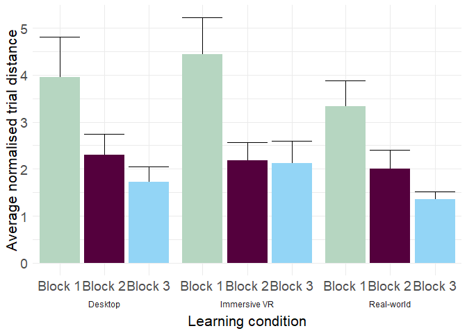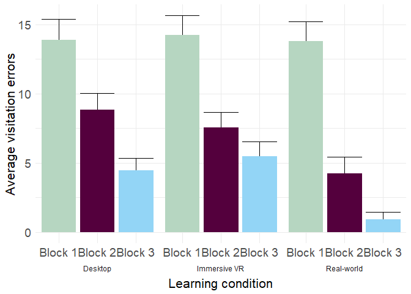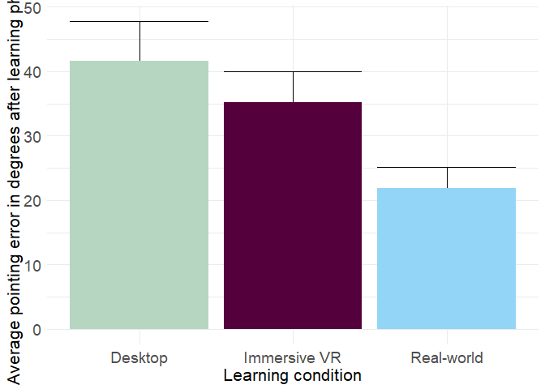

Quantifying what happens after/during? transfer
-----------------------------------------------

We next considered the effects of transferring from either the treadmill or desktop to the real-world building compared with continuing to navigate the real-world building. We did this by directly comparing walked distance and visitation errors on block 3 (the last block before the transfer phase) with the first block of the transfer phase (block 4). Data for distance walked and number of door visitation errors were each entered into a 3 (Learning Condition: real, desktop, treadmill VR) × 2 (Block: block 1, block 4) mixed-model ANOVA. For visitation errors, there was a main effect for Learning Condition,*F*(2, 58)=13.66, *M**S**E* = 10.61, *p* &lt; .001. There was a main effect for Block, *F*(1, 58)=42.67, *M**S**E* = 2.19, *p* &lt; .001. The Learning Condition by Block interaction effect was significant, *F*(2, 58)=9.22, *M**S**E* = 2.19, *p* &lt; .001. For walked distance, there was a main effect of Learning Condition,*F*(2, 58)=6.65, *M**S**E* = 0.90, *p* = .003, but no effect of Block, *F*(1, 58)=2.61, *M**S**E* = 0.78, *p* = .111, and the interaction also failed to reach significance, *F*(2, 58)=1.89, *M**S**E* = 0.78, *p* = .161.

To better understand these differences, we ran separate pairwise t-tests to assess the change from block 3 (last block of learning phase) to block 4 (first block of transfer phase). For distance, we found no significant differences from block 3 (M = 1.363 , SD = 0.745) to block 4 (M = 1.509 , SD = 0.872) for the real-world learning condition, *t*(193.54)= − 1.27, *p* = .207. Similarly, there was no difference between block 3 (M = 2.127 , SD = 2.52) and block 4 (M = 1.964 , SD = 2.088) for the treadmill VR condition, *t*(206.77)=0.51, *p* = .609. For visitation errors, we found an improvement in all conditions, although the effects sizes were greater for the treadmill compared to the desktop conditions. Together, these findings suggested that participants maintained or improved for both distance and visitation errors, although these effects were generally smaller, and even tending toward being worse, for the desktop condition. For summary please see table XXX.

| learning.condition | exp\_block\_id |     M|    Sd|
|:-------------------|:---------------|-----:|-----:|
| Desktop            | 3              |  1.72|  1.73|
| Desktop            | 4              |  2.18|  2.02|
| Real               | 3              |  1.36|  0.75|
| Real               | 4              |  1.51|  0.87|
| Treadmill VR       | 3              |  2.13|  2.52|
| Treadmill VR       | 4              |  1.96|  2.09|

| condition    |  Mdiff|   df|      t| p         |      d| CI          |
|:-------------|------:|----:|------:|:----------|------:|:------------|
| Real         |  -0.15|   21|  -1.17| p = 0.256 |  -0.25| -0.41, 0.12 |
| Desktop      |  -0.70|   18|  -1.79| p = 0.09  |  -0.41| -1.53, 0.12 |
| Treadmill VR |   0.04|   19|   0.16| p = 0.877 |   0.04| -0.55, 0.63 |

| learning.condition | exp\_block\_id |     M|    Sd|
|:-------------------|:---------------|-----:|-----:|
| Desktop            | 3              |  4.46|  4.65|
| Desktop            | 4              |  3.11|  5.62|
| Real               | 3              |  0.91|  3.27|
| Real               | 4              |  0.27|  1.70|
| Treadmill VR       | 3              |  5.47|  6.00|
| Treadmill VR       | 4              |  2.13|  5.22|

| condition    |  Mdiff|   df|     t| p           |     d| CI         |
|:-------------|------:|----:|-----:|:------------|-----:|:-----------|
| Real         |   0.64|   21|  2.56| p = 0.018   |  0.55| 0.12, 1.17 |
| Desktop      |   1.35|   18|  2.44| p = 0.025   |  0.56| 0.19, 2.52 |
| Treadmill VR |   3.34|   19|  5.97| p &lt; .001 |  1.33| 2.17, 4.51 |

Quantifying transfer
--------------------

To assess the level of performance change form directly before and after the switch, we calculated percent improvement score as (pre-switch performance - post-switch performance)/(pre-switch performance + post-switch performance) This allowed us to directly compare the relative improvement or deterioration from pre-switch block to the post-switch one. These findings are shown in Figure XX for normalized distance (Figure XXa) and visitation errors (Figure XXb).

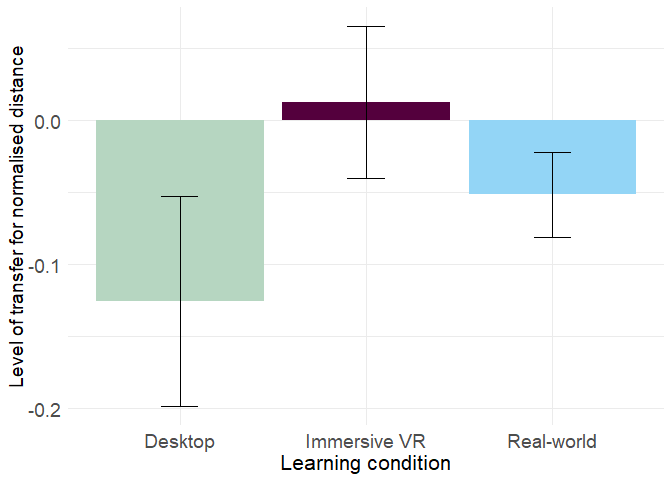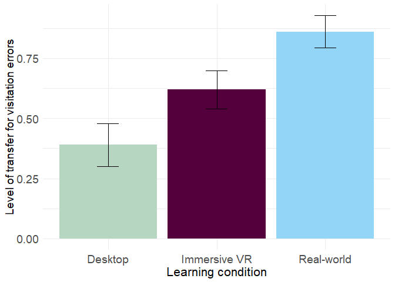

Comparing the improvement in walked distance using one-way ANOVA, we see did not find any significant difference between groups *F*(2, 58)=1.64, *M**S**E* = 0.06, *p* = .202. Visual inspection of the data, however, suggested that the desktop condition again showed the least transfer from block 3 to block 4. For visitation errors, there were significant group differences in error rate improvement, *F*(2, 49)=6.72, *M**S**E* = 0.13, *p* = .003. Comparing the conditions pairwise, we can asses that there is a significant difference in improvement between real world learnign and desktop (*t*(28.88)= − 3.76, *p* = .001), as well as Treadmill VR, *t*(27.73)=2.03, *p* = .052, but we find no difference in improvement betweem desktop learning and Treadmill VR learning, *t*(36.26)= − 1.93, *p* = .062.

Together, these findings suggest that transfer from desktop to real-world environments resulted in an increase in visitation errors, while no change was present for immersive and real-world conditions.

Quantifying what happens after transfer
---------------------------------------

As an additional assay of transfer, we wished to determine whether learning post modality switch was faster in the group that had been exposed to the real-world in the learning blocks compared to the VR groups. Comparing walked distance and visitation errors across between blocks 4 and 6 by running repeated measures ANOVA, we found a significant effect of learning condition on distance,*F*(2, 57)=3.98, *M**S**E* = 0.62, *p* = .024 and visitation errors *F*(2, 58)=5.72, *M**S**E* = 4.74, *p* = .005. We also wound significant interaction effect between learning condition and block for both distance *F*(2, 57)=3.98, *M**S**E* = 0.62, *p* = .024 and visitation errors *F*(2, 58)=5.72, *M**S**E* = 4.74, *p* = .005.

Looking at the improvement in visitations errors from block 4 to block 6 in separate learning conditions using t-tests, we can assess that only Desktop group (*t*(129.28)=5.15, *p* &lt; .001) and Treadmill VR group (*t*(182.98)=3.11, *p* = .002) have improved, whereas group learned in the real world did not improve any more in the transfer phase (*t*(134.34)=1.53, *p* = .129).

The story is similar with distance performance, with both Desktop (*t*(96.10)=4.17, *p* &lt; .001) and Treadmill VR (*t*(99.71)=2.69, *p* = .008) improve from the 4th to the 6th block, but so does the real world learning group (*t*(119.02)=3.06, *p* = .003).

In the last testing block (block 6), we found no differences among the groups in either error rate (*F*(2, 363)=1.67, *M**S**E* = 3.33, *p* = .191), nor pointing performance (*F*(2, 726)=1.56, *M**S**E* = 982.05, *p* = .210). However we still see small difference in distance performance (*F*(2, 255)=3.21, *M**S**E* = 0.10, *p* = .042), with real group (M = 1.245 , SD = 0.195) performing better than Treadmill VR group (M = 1.37 , SD = 0.383)(*t*(102.13)= − 2.55, *p* = .012) and desktop group (M = 1.285 , SD = 0.368)(*t*(131.62)=0.90, *p* = .369).

Could effects be driven by difficulty with the immersive interface?
-------------------------------------------------------------------

To attempt to address this issue, we compared the three different modalities, navigating in the real-world (real-world), navigating on the treadmill with the head-mounted display (immersed), and navigating with a joystick in desktop VR (impoverished) on the first block of the experiment. Comparing normalized distances, there were no difference between (*F*(2, 323)=1.99, *M**S**E* = 16.13, *p* = .139), nor in visitation errors (*F*(2, 363)=0.10, *M**S**E* = 64.52, *p* = .903). This suggests that participants were readily able to navigate in the different modalities regardless of the interface. We did, however, find a significant difference in normalized time (*F*(2, 363)=28.57, *M**S**E* = 24.22, *p* &lt; .001). This effect appeared to be driven largely by the fact that treadmill VR participants took to get used to the interface and therefore having longer trial times at the start.

Experiment 1b: Comparing transfer from desktop to real and treadmill to desktop
-------------------------------------------------------------------------------

Based on our findings above, we might predict that transferring knowledge from desktop to the real world was most difficult for subjects, with the immersive group somewhere in between. We also found, that despite the groups differ at the end of the learning phase, their performance is the same after three blocks in the transfer phase. It is unclear, whether this equalisation of performance is solely due to exposure to the real world, and wihout it participants could never perform perfectly, or if the tradmill VR modality could achieve the same performance as the real world training, but it only needs more time.

To test this idea, we added two more conditions. One group learned the UC Center for Neuroscience building on the treadmill VR while the second group learned in the real world, but both were tested in the tradmill VR in the transfer phase. This allowed us to assess if the treadmill VR can achieve the same performance given additional time and also investigate the process of opposite transfer.

### Participants

A total of 70 undergraduate students at UC Davis particiapted in the second experiment. 27 participants didn't finish due to motion sickness. Analyses were then conducted on a final set of 41 (14 female) participants(M = 19.951 , SD = 1.548).

| condition |   no|  yes|  percent|
|:----------|----:|----:|--------:|
| real-vr   |    3|   22|     0.88|
| vr-vr     |   24|   21|     0.47|

    ## # A tibble: 2 x 2
    ## # Groups:   sex [2]
    ##   sex       nn
    ##   <chr>  <int>
    ## 1 Female    27
    ## 2 Male      14

Quantifying performance in the last block
-----------------------------------------

First we assessed difference between the two learning conditions in the last block performance usint t-tests. The conditions did not differ in the walking performance (*t*(152.12)= − 0.88, *p* = .378) nor visiting errors (*t*(228.89)=0.29, *p* = .771), therefore showing that both treadmill VR and real world learning leads to the same performance in the VR.

Comparing to previous conditions
--------------------------------

Running a one-way ANOVA togeher together with other conditions from the first experiment (real to real, Vr - real and desktop to real), shows a significant effect of condition on final walking performance (*F*(4, 498)=3.68, *M**S**E* = 0.19, *p* = .006).

|                   |        diff| p-value     |
|-------------------|-----------:|:------------|
| real-vr-real-real |  -0.1028174| p = 0.416   |
| ve-real-real-real |   0.0395100| p = 0.972   |
| vr-real-real-real |   0.1245411| p = 0.34    |
| vr-vr-real-real   |  -0.0449432| p = 0.94    |
| ve-real-real-vr   |   0.1423274| p = 0.13    |
| vr-real-real-vr   |   0.2273585| p &lt; .001 |
| vr-vr-real-vr     |   0.0578741| p = 0.832   |
| vr-real-ve-real   |   0.0850311| p = 0.721   |
| vr-vr-ve-real     |  -0.0844533| p = 0.62    |
| vr-vr-vr-real     |  -0.1694844| p = 0.058   |

Looking at the final walking performance in the Table XXX, we can see that the differences between conditions are truly negligible. Interestingly, we found no significant difference between the conditions when we analysed absolute distance, rather than normalised (*F*(4, 498)=1.42, *M**S**E* = 147.36, *p* = .225). This means that all aprticipants walked the same distance in the end on average, regardless of them being tested on a treadmill or in the real building. We also found no difference between any of the conditions in their final pointing performance, *F*(4, 1216)=2.32, *M**S**E* = 818.28, *p* = .055.

| condition | dist                   | errors                 |
|:----------|:-----------------------|:-----------------------|
| real-real | M = 1.245 , SD = 0.195 | M = 0.038 , SD = 0.192 |
| real-vr   | M = 1.142 , SD = 0.225 | M = 2.342 , SD = 2.818 |
| ve-real   | M = 1.285 , SD = 0.368 | M = 0.307 , SD = 1.512 |
| vr-real   | M = 1.37 , SD = 0.383  | M = 0.45 , SD = 2.819  |
| vr-vr     | M = 1.2 , SD = 0.697   | M = 2.246 , SD = 2.279 |

A different story is in comparing the visitation errors across conditions in the last block, where one-way ANOVA shows significant difference (*F*(4, 607)=33.64, *M**S**E* = 4.62, *p* &lt; .001) and Tukey's post hoc tests demonstrates significant differences between all conditions that differs in transfer phase modality, e.g. participants in the real world always perform better than participants on the treadmill VR. Looking at the table XXX, we can clearly see that conditions with transfer phase happening in VR, despite having comparable walked distance, have higher number of visitation errors. We think that this may have emerged from two different sources: firstly, it can point to higher difficulty in recognizing proper doors because of lesser visual accuracy in the VR, where all doors look similar unlike real doors which may demonstrate unique signs of wear or use. The second reason for the increased number of visitation errors in VR conditions can be explained by the lesser "social impact" of wrong choice. Whereas in the real conditions, participants had to actively inquire the experimenter, there was technically no penalty for "trying out" wrong door in the VR.

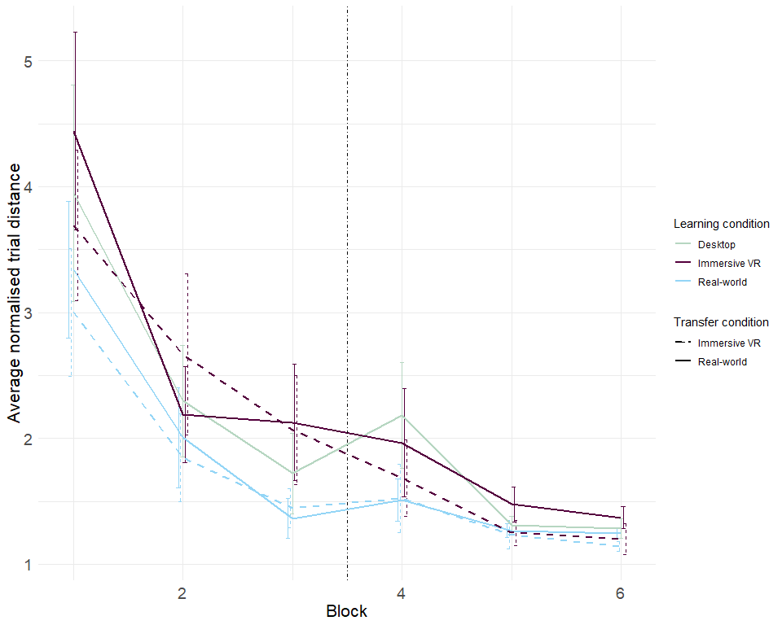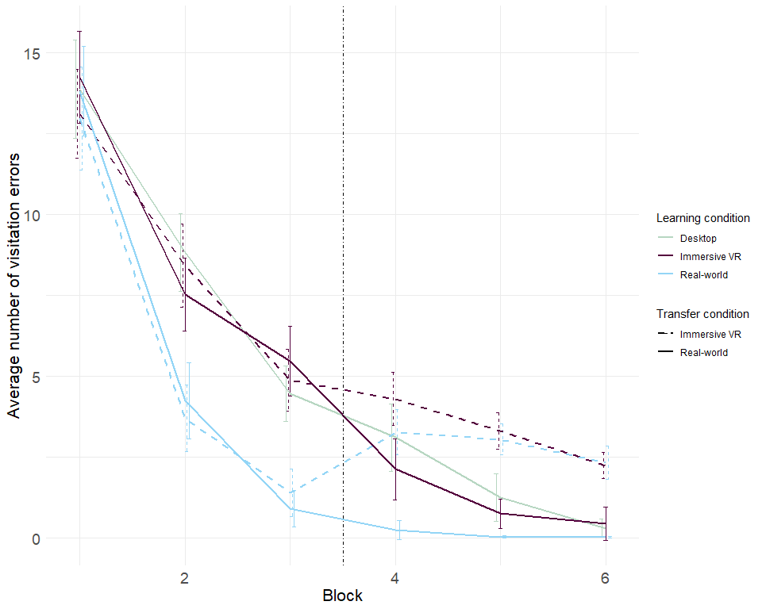

### Quantifying transfer

Assessing the effects of trasfering from the real world to the Treadmill VR, we ran 2 (Learning condition: real vs treadmill VR) x 2 (block 3 vs blcok 4) ANOVA on data for distance walked and visitation errors. There was no effect of block *F*(1, 38)=1.10, *M**S**E* = 0.47, *p* = .301 nor learning condition (*F*(1, 38)=3.47, *M**S**E* = 0.83, *p* = .070) on distance walked and we observed no interaction effects (*F*(1, 38)=2.40, *M**S**E* = 0.47, *p* = .129). But we found significant interaction effect between block and learning condition in visitation errors, *F*(2, 58)=9.22, *M**S**E* = 2.19, *p* &lt; .001.

Pairwise t-tests comparing change in error rate from 3rd to 4th block show, that the group learning on the treadmill VR does show significant difference (*t*(244.20)=0.91, *p* = .362) as it effectively didn't change the environment, but the group switching to the VR from the real world demonstrates increase in visitations errors from block 3 (M = 1.408 , SD = 4.094) to block 4 (M = 3.275 , SD = 3.874), *t*(237.27)= − 3.63, *p* &lt; .001.

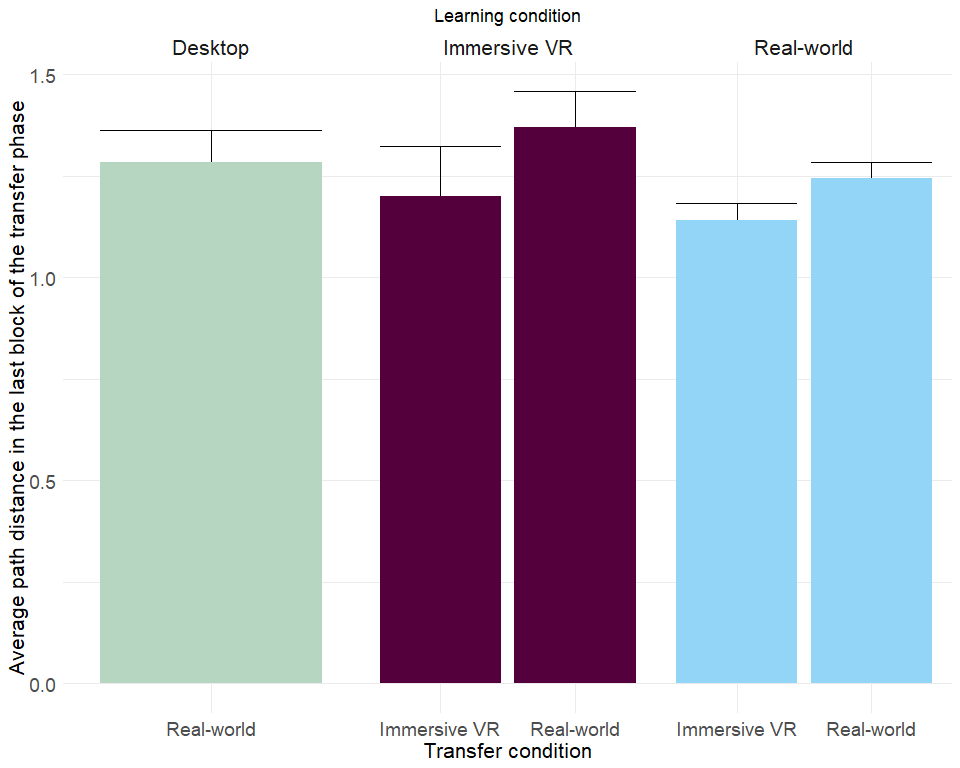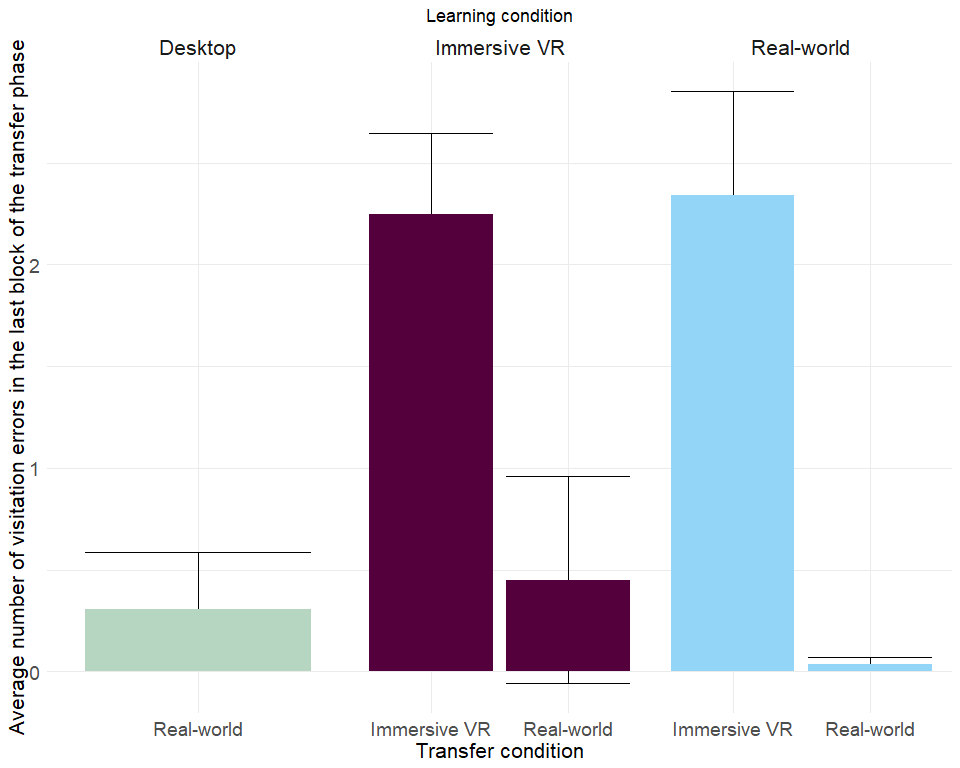

### Summary

In the last block, all conditios perform similarly as far as the walking distance goes, regardless of them being tested on the VR or in the real building. VR leads to overall higher error rates, but same walking performance, even when considering absolute distances. There are no significant differences in pointing performance between conditions, regardless of pointing being tested in the real world or in the VR.
