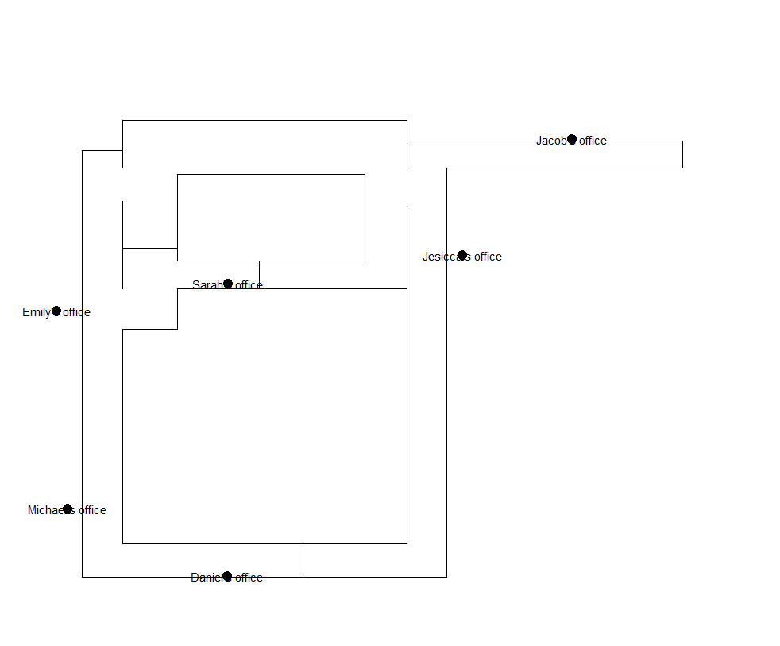

```{r setup, include=FALSE}
library(ggplot2)
library(dplyr)
library(restimoter)
library(navr)
library(brainvr.R)
source_folder <- function(path){
  sapply(list.files(pattern = "[.]R$", path = path, full.names = TRUE), source);
}
source_folder("../TwoWorlds/")

sop_all <- read.table("../sop.csv", sep=";", header = T, stringsAsFactors = F)
walk_all <- read.table("../walk.csv", sep=";", header = T, stringsAsFactors = F)
load("../multi.data")
load("../settings.data")
df_participants <- settings$participants
df_participants$condition <- paste0(df_participants$First.phase, "-", df_participants$Second.phase)
```

# Methods

## Overview

Free roaming phase while searching fo 6 offices

The CNS has 30 eligible doors in total, 6 doors are ascribed to fictional workers: Emily, Michael, Daniel, Jesicca, Jacob and Sarah 
 - Taken from the list of most used names in CA from 2000

4 pointing locations

{width=500px}

## Design

Full experiemntal design with 4 possible conditions

- vr - vr
- real - vr
- vr - real
- real - real

## Procedure

Questionnaire

Virtualiser training; regardless of their condition (even in real-to real)

Experiment has 2 phases, each has two parts: walking/pointing

- Free roaming from door to door - all 6 ofices in 3 blocks (18 trials)
- Pointing from 2 points to all 6 offices; exactly one office is always visible

Drawing building layout

## Settings

6 possible settings

Example: Sarah - Jacob - Emily - Michael - Daniel - Jesicca

Pointing fromn Viewpoint 1 and 3

Never pointing from the same viewpoints in both cases

# Participants

## Number crunching
So far we:

- scheduled 56 timeslots
- administered 45 participants
- have `r length(unique(walk_all$id))` usable subjects
- wasted 5 working days

There are some issues with high dropout rate, so far about a 1/3

--- 

Dropout by condition

```{r, echo = F,warning=FALSE}
ggplot(df_participants, aes(x = condition, fill = finished)) + geom_bar(position = "dodge")
```

---
Average time spent in the device per condition

```{r, echo = F}
ggplot(walk_all, aes(x = type, y = 18*(time), fill = factor(phase))) + geom_bar( stat = "summary", fun.y = "mean", position = "dodge")
```

---

Dropout by gender
```{r, echo = F,warning=FALSE}
ggplot(df_participants, aes(x = condition, fill = finished)) + 
  geom_bar(position = "dodge") + facet_grid(.~sex)
```

---

Dropout by ethnicity

```{r, echo = F,warning=FALSE}
ggplot(df_participants, aes(x = condition, fill = finished)) + 
  geom_bar(position = "dodge") + facet_grid(.~ethnicity)
```


# Preprocessing

---

- So far no outliers have been removed
- Paths haven't been smoothed
- Because of VR-real world differences, distances and times have been *min-normalised*

Min-normalisation: 

- Dividing path traveled in a particular task by the shortest path traveled in that particular task and device
- Esentially gives you how many times the participant traveled more than necessary (2x, 1.5x)

## The bad
Unfortunatelly, out of `r as.numeric(walk_all %>% filter(type == "restimote") %>% count())` trials in the restimote we have `r as.numeric(walk_all %>% filter(type == "restimote") %>% filter(is.na(distance)) %>% count())` not fully executed. 

```{r, echo=F, warning=FALSE, message=F}
plot_walk_trial(ls$tw11$phase2, 8)
```

## Path examples

Unity

```{r, echo=F, warning=FALSE, message=F}
plot_walk_trial(ls$tw11$phase1, 8)
```

---

Real

```{r, echo=F, warning=FALSE, message=F}
plot_walk_trial(ls$tw29$phase1, 3)
```

## Pointing examples

Unity

```{r, echo=F, warning=FALSE, message=F}
plot_sop_point(ls$tw18$phase2, 4)
```

---

Real

```{r, echo=F, warning=FALSE, message=F}
plot_sop_point(ls$tw29$phase1, 3)
```

# Results

## Distance

Distance absolute
```{r, echo = F,warning=FALSE}
ggplot(walk_all, aes(x = condition, y = distance, fill=factor(phase))) +
  stat_summary(fun.data=mean_cl_normal,position=position_dodge(0.95),geom="errorbar") + 
  stat_summary(fun.y=mean,position=position_dodge(width=0.95),geom="bar")
```

---

Distance normalised
```{r, echo = F, warning=FALSE}
ggplot(walk_all, aes(x = condition, y = min_norm_distance, fill=factor(phase))) +
  stat_summary(fun.data=mean_cl_normal,position=position_dodge(0.95),geom="errorbar") + 
  stat_summary(fun.y=mean,position=position_dodge(width=0.95),geom="bar")
```

---

```{r, echo = F, results='hide'}
walk_all %>% 
  group_by(condition) %>% 
  summarise(p.value = t.test(distance ~ phase)$p.value,
            phase1 = t.test(distance ~ phase)$estimate[[1]],
            phase2 = t.test(distance ~ phase)$estimate[[2]])
```

```{r, echo = T}
aov_distance_condition <- aov(min_norm_distance~condition*phase, 
                              data = walk_all)
summary(aov_distance_condition)
```

```{r, echo = T}
aov_distance_condition_2 <- aov(min_norm_distance~condition, 
                              data = walk_all[walk_all$phase == 2,])
summary(aov_distance_condition_2)
```

## Time

Time absolute
```{r, echo = F,warning=FALSE}
ggplot(walk_all, aes(x = condition, y = time, fill=factor(phase))) +
  stat_summary(fun.data=mean_cl_normal,position=position_dodge(0.95),geom="errorbar") + 
  stat_summary(fun.y=mean,position=position_dodge(width=0.95),geom="bar")
```

---

Time normalised
```{r, echo = F,warning=FALSE}
ggplot(walk_all, aes(x = condition, y = min_norm_time, fill=factor(phase))) +
  stat_summary(fun.data=mean_cl_normal,position=position_dodge(0.95),geom="errorbar") + 
  stat_summary(fun.y=mean,position=position_dodge(width=0.95),geom="bar")
```

---

```{r, echo = F,results='hide'}
walk_all %>% 
  group_by(condition) %>% 
  summarise(p.value = t.test(time ~ phase)$p.value,
            phase1 = t.test(time ~ phase)$estimate[[1]],
            phase2 = t.test(time ~ phase)$estimate[[2]])
```

```{r, echo = T}
aov_time_condition <- aov(min_norm_time~condition*phase, 
                              data = walk_all)
summary(aov_time_condition)
```

```{r, echo = T}
aov_time_condition_2 <- aov(min_norm_time~condition, 
                              data = walk_all[walk_all$phase == 2,])
summary(aov_time_condition_2)
```

## Pointing accuracy

```{r, echo = F,warning=FALSE}
ggplot(sop_all, aes(x = condition, y = abs(error), fill=factor(phase))) +
  stat_summary(fun.data=mean_cl_normal,position=position_dodge(0.95),geom="errorbar") + 
  stat_summary(fun.y=mean,position=position_dodge(width=0.95),geom="bar")
```

---

```{r, echo = T}
aov_point_condition <- aov(abs(error)~condition*phase, 
                           data = sop_all)
summary(aov_point_condition)
```

```{r, echo = T}
aov_point_condition_2 <- aov(abs(error)~condition, 
                             data = sop_all[sop_all$phase == 2, ])
summary(aov_point_condition_2)
```

# What now?

## TODO

Get about 15-16 more participants

Smooth paths and try to clean it enough to get less estimote dropouts

Remove outliers

Work with "wrong-door" stats


## Questions

Should we run two same settings? To directly compare performance in the same sequence of goals and points?

Look are initial 3 trials performance after environment shift vs no shift

Look at progressive learning curve from block to block, rather than phase summaries

Add in scalp EEG
