Transfer report
================
Lukáš 'hejtmy' Hejtmánek
4 June 2018

Per phase separation
--------------------

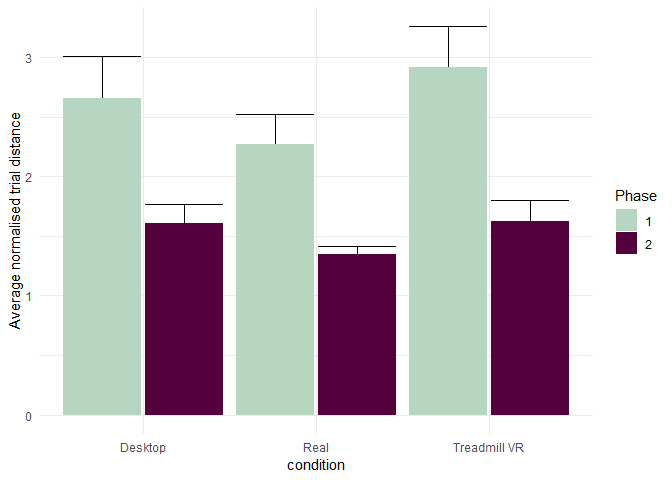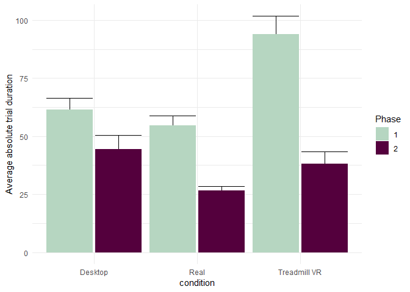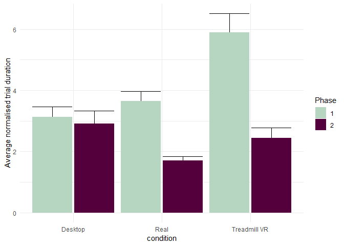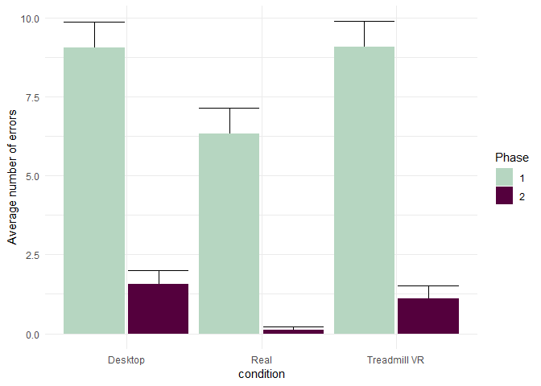

PER BLOCK
---------

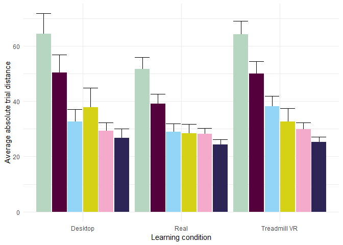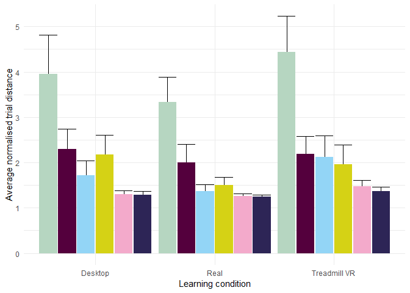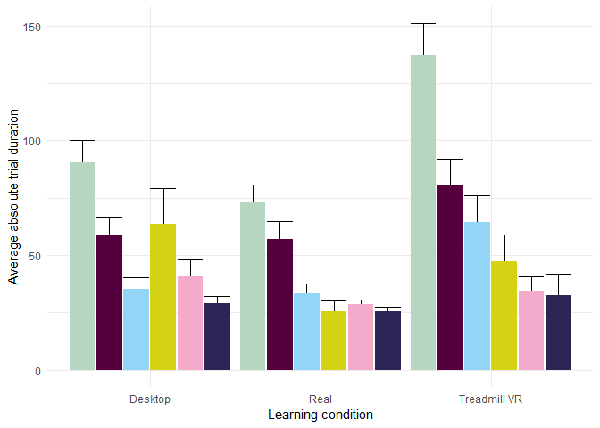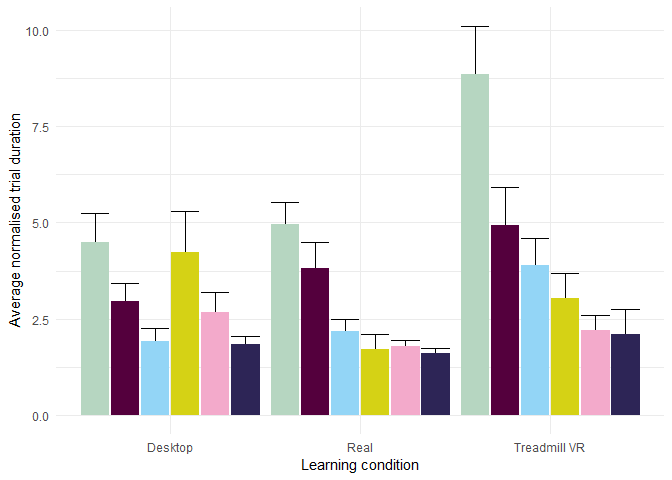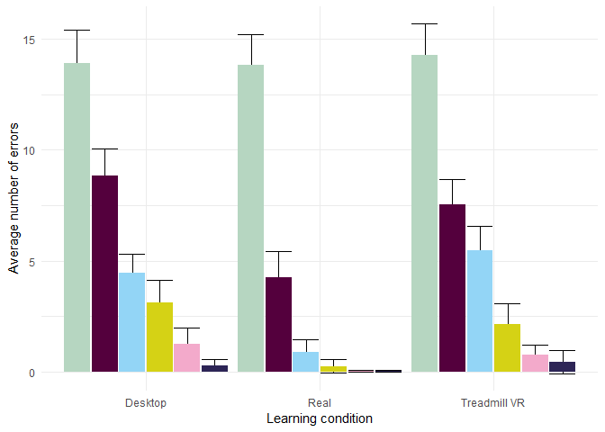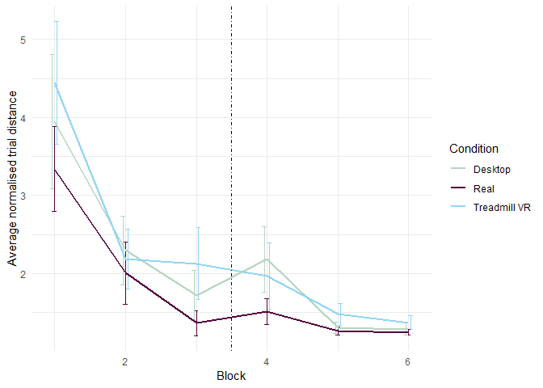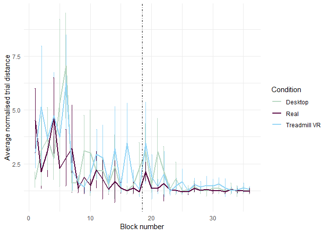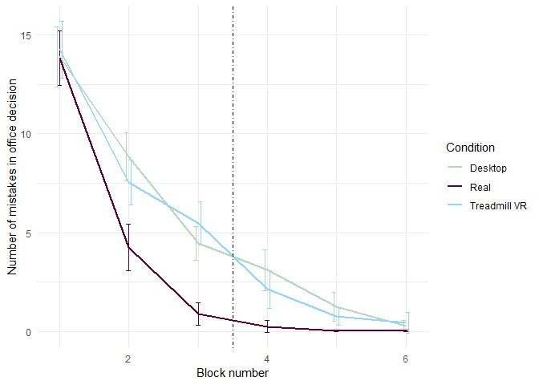

Pointing
--------

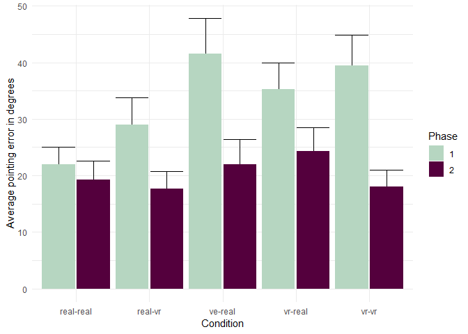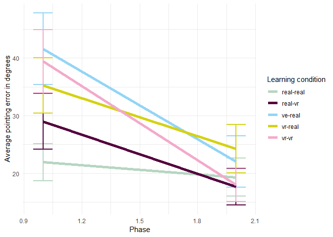

Block measures
==============

Sum of errors
-------------

Measure of overall sum of errors. Mean columns define mean sum of errors for all participants in that block

| learning.condition |  block1.mean|  block3.mean|  block4.mean|  block34.diff|  block34.se|  block14.diff|  block14.se|
|:-------------------|------------:|------------:|------------:|-------------:|-----------:|-------------:|-----------:|
| Desktop            |     83.31579|    26.789474|    18.684210|     0.3896903|   0.0890157|     0.6801146|   0.0711650|
| Real               |     82.90909|     5.454546|     1.590909|     0.8607021|   0.0679299|     0.9632893|   0.0268788|
| Treadmill VR       |     85.50000|    32.850000|    12.800000|     0.6195643|   0.0792096|     0.7899438|   0.0538944|

    ## Using learning.condition as id variables

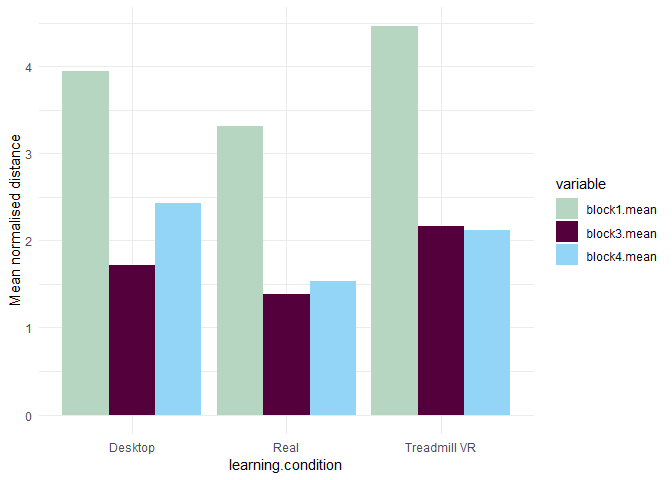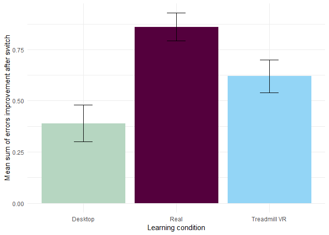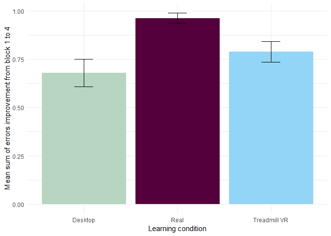

Normalised distance
-------------------

Measure of mean distance. First three columns define mean normalised distance in each block.

| learning.condition |  block1.mean|  block3.mean|  block4.mean|  block34.diff|  block34.se|  block14.diff|  block14.se|
|:-------------------|------------:|------------:|------------:|-------------:|-----------:|-------------:|-----------:|
| Desktop            |     3.947872|     1.722262|     2.854267|    -0.1640028|   0.0738046|     0.1963527|   0.0763993|
| Real               |     3.522940|     1.575323|     1.593967|    -0.0190986|   0.0306256|     0.3613898|   0.0527887|
| Treadmill VR       |     4.739353|     2.218745|     2.249314|    -0.0037351|   0.0487285|     0.3430108|   0.0600789|

    ## Using learning.condition as id variables

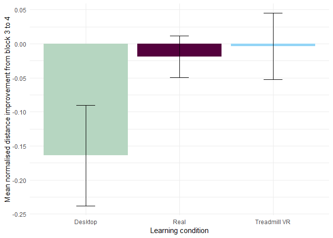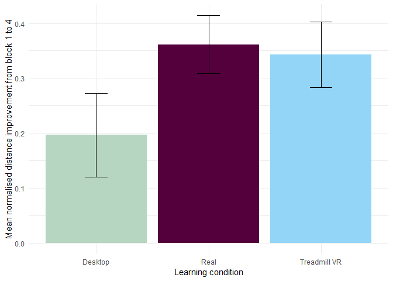

Stats
=====

Block T tests
-------------

Paired block comparisons for improvement in different condiutions

### Block 3-4

Paired t tests between min normalised distance difference in blocks 3 and 4.

| condition |    estimate|   statistic|    p.value|  parameter|    conf.low|  conf.high| method        | alternative |
|:----------|-----------:|-----------:|----------:|----------:|-----------:|----------:|:--------------|:------------|
| real-real |  -0.0186440|  -0.1581716|  0.8758327|         21|  -0.2637728|  0.2264847| Paired t-test | two.sided   |
| ve-real   |  -1.1320052|  -2.0610797|  0.0540446|         18|  -2.2858929|  0.0218826| Paired t-test | two.sided   |
| vr-real   |  -0.0305689|  -0.1145055|  0.9100385|         19|  -0.5893326|  0.5281947| Paired t-test | two.sided   |

And for number of errors

| condition |   estimate|  statistic|    p.value|  parameter|   conf.low|  conf.high| method        | alternative |
|:----------|----------:|----------:|----------:|----------:|----------:|----------:|:--------------|:------------|
| real-real |  0.6439394|   2.559690|  0.0182545|         21|  0.1207725|   1.167106| Paired t-test | two.sided   |
| ve-real   |  1.3508772|   2.436782|  0.0254278|         18|  0.1861905|   2.515564| Paired t-test | two.sided   |
| vr-real   |  3.3416667|   5.966635|  0.0000096|         19|  2.1694500|   4.513883| Paired t-test | two.sided   |

### Block 1-4

Paired t tests between min normalised distance difference in blocks 1 and 4.

| condition    |     estimate|  statistic|    p.value|  parameter|    conf.low|  conf.high| method        | alternative |
|:-------------|------------:|----------:|----------:|----------:|-----------:|----------:|:--------------|:------------|
| real-real    |     1.928734|   5.431976|  0.0000257|         20|   1.1880702|   2.669398| Paired t-test | two.sided   |
| ve-real      |     1.093604|   1.928134|  0.0697654|         18|  -0.0980027|   2.285211| Paired t-test | two.sided   |
| vr-real      |     2.490039|   5.001329|  0.0000793|         19|   1.4479740|   3.532105| Paired t-test | two.sided   |
| And for numb |  er of error|          s|           |           |            |           |               |             |

| condition |  estimate|  statistic|  p.value|  parameter|   conf.low|  conf.high| method        | alternative |
|:----------|---------:|----------:|--------:|----------:|----------:|----------:|:--------------|:------------|
| real-real |  13.55303|  16.871461|    0e+00|         21|  11.882454|   15.22361| Paired t-test | two.sided   |
| ve-real   |  10.77193|   8.716213|    1e-07|         18|   8.175506|   13.36835| Paired t-test | two.sided   |
| vr-real   |  12.11667|  16.957736|    0e+00|         19|  10.621156|   13.61218| Paired t-test | two.sided   |

### Block 1-6

Paired t tests between min normalised distance difference in blocks 1 and 6.

| condition |  estimate|  statistic|  p.value|  parameter|  conf.low|  conf.high| method        | alternative |
|:----------|---------:|----------:|--------:|----------:|---------:|----------:|:--------------|:------------|
| real-real |  2.283372|   8.817858|  0.0e+00|         20|  1.743215|   2.823529| Paired t-test | two.sided   |
| ve-real   |  2.563180|   6.199245|  7.5e-06|         18|  1.694519|   3.431841| Paired t-test | two.sided   |
| vr-real   |  3.511071|   8.363107|  1.0e-07|         18|  2.629044|   4.393098| Paired t-test | two.sided   |

And for number of errors

| condition |  estimate|  statistic|  p.value|  parameter|  conf.low|  conf.high| method        | alternative |
|:----------|---------:|----------:|--------:|----------:|---------:|----------:|:--------------|:------------|
| real-real |  13.78030|   18.56191|        0|         21|  12.23640|   15.32420| Paired t-test | two.sided   |
| ve-real   |  13.57895|   14.64365|        0|         18|  11.63078|   15.52712| Paired t-test | two.sided   |
| vr-real   |  13.80000|   21.50907|        0|         19|  12.45714|   15.14286| Paired t-test | two.sided   |

Independent block improvement comparisons between conditions for distance
-------------------------------------------------------------------------

### Block 1-4 improvement

| Comparison        |  mean.first|  mean.second|    p.value|
|:------------------|-----------:|------------:|----------:|
| Desktop - real    |  -0.1440074|   -0.3589776|  0.0553851|
| Treadmil - real   |  -0.3252250|   -0.3589776|  0.6757288|
| Treadmil- Desktop |  -0.3252250|   -0.1440074|  0.1147730|

### Block 3-4 improvement

| Comparison        |  mean.first|  mean.second|    p.value|
|:------------------|-----------:|------------:|----------:|
| Desktop - real    |   0.1640028|    0.0190986|  0.0822302|
| Treadmil - real   |   0.0037351|    0.0190986|  0.7912053|
| Treadmil- Desktop |   0.0037351|    0.1640028|  0.0795178|

Independent block improvement comparisons between conditions for number of errors
---------------------------------------------------------------------------------

### Block 1-4 improvement

| Comparison        |  mean.first|  mean.second|    p.value|
|:------------------|-----------:|------------:|----------:|
| Desktop - real    |  -0.6065031|   -0.9268407|  0.0000562|
| Treadmil - real   |  -0.6421871|   -0.9268407|  0.0000038|
| Treadmil- Desktop |  -0.6421871|   -0.6065031|  0.6308941|

### Block 3-4 improvement

| Comparison        |  mean.first|  mean.second|    p.value|
|:------------------|-----------:|------------:|----------:|
| Desktop - real    |  -0.3896903|   -0.8607021|  0.0007781|
| Treadmil - real   |  -0.6195643|   -0.8607021|  0.0518405|
| Treadmil- Desktop |  -0.6195643|   -0.3896903|  0.0615618|

Anova
-----

Simple between subjects anova

|                                   |    Df|       Sum Sq|      Mean Sq|     F value|  Pr(&gt;F)|
|-----------------------------------|-----:|------------:|------------:|-----------:|----------:|
| exp\_block\_id                    |     1|   1212.43888|  1212.438885|  191.138055|  0.0000000|
| learning.condition                |     2|     65.68384|    32.841918|    5.177449|  0.0057266|
| exp\_block\_id:learning.condition |     2|     28.95909|    14.479545|    2.282665|  0.1023067|
| Residuals                         |  1803|  11436.90255|     6.343263|          NA|         NA|

### Normalised distance

Within subjects anova for block 3-4 difference.

<table class="kable_wrapper">
<tbody>
<tr>
<td>
|     | Effect                            |  DFn|  DFd|         F|          p| p&lt;.05 |        ges|
|-----|:----------------------------------|----:|----:|---------:|----------:|:---------|----------:|
| 2   | learning.condition                |    2|   58|  3.310848|  0.0434950| \*       |  0.0664271|
| 3   | exp\_block\_id                    |    1|   58|  3.998625|  0.0502287|          |  0.0253169|
| 4   | learning.condition:exp\_block\_id |    2|   58|  3.406268|  0.0399301| \*       |  0.0423779|

</td>
</tr>
</tbody>
</table>
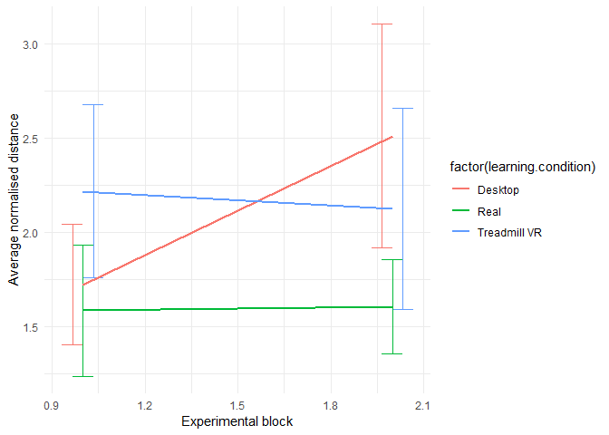

Within subjects anova for block 1-4 difference in minimal path.

<table class="kable_wrapper">
<tbody>
<tr>
<td>
|     | Effect                            |  DFn|  DFd|          F|          p| p&lt;.05 |        ges|
|-----|:----------------------------------|----:|----:|----------:|----------:|:---------|----------:|
| 2   | learning.condition                |    2|   57|   3.902843|  0.0257905| \*       |  0.0704320|
| 3   | exp\_block\_id                    |    1|   57|  44.825263|  0.0000000| \*       |  0.2599699|
| 4   | learning.condition:exp\_block\_id |    2|   57|   2.127102|  0.1285465|          |  0.0322646|

</td>
</tr>
</tbody>
</table>
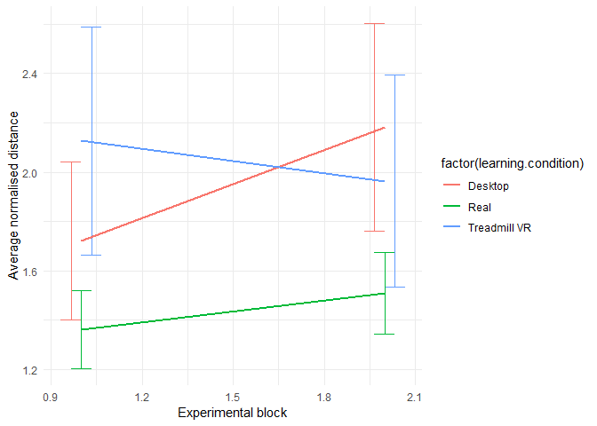

### Number of errors

Within subjects anova for block 1-4 number of errors.

<table class="kable_wrapper">
<tbody>
<tr>
<td>
|     | Effect                            |  DFn|  DFd|           F|          p| p&lt;.05 |        ges|
|-----|:----------------------------------|----:|----:|-----------:|----------:|:---------|----------:|
| 2   | learning.condition                |    2|   57|    2.777875|  0.0706020|          |  0.0452731|
| 3   | exp\_block\_id                    |    1|   57|  220.022968|  0.0000000| \*       |  0.6646649|
| 4   | learning.condition:exp\_block\_id |    2|   57|    2.406574|  0.0992268|          |  0.0415576|

</td>
</tr>
</tbody>
</table>

Within subjects anova for block 3-4 number of errors.

<table class="kable_wrapper">
<tbody>
<tr>
<td>
|     | Effect                   |  DFn|  DFd|         F|          p| p&lt;.05 |        ges|
|-----|:-------------------------|----:|----:|---------:|----------:|:---------|----------:|
| 2   | condition                |    2|   58|  7.758076|  0.0010335| \*       |  0.1650409|
| 3   | exp\_block\_id           |    1|   58|  5.135623|  0.0271868| \*       |  0.0225990|
| 4   | condition:exp\_block\_id |    2|   58|  1.247006|  0.2949528|          |  0.0111038|

</td>
</tr>
</tbody>
</table>
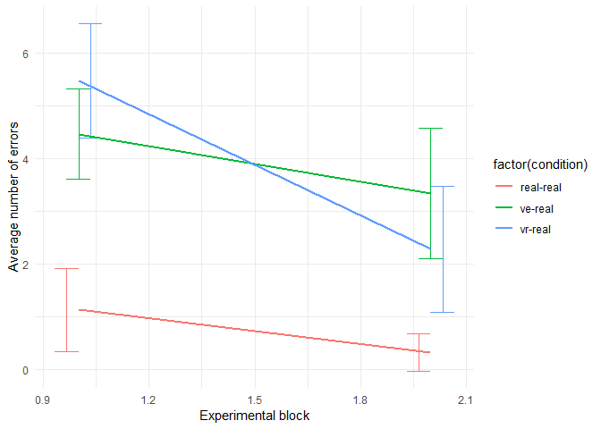
