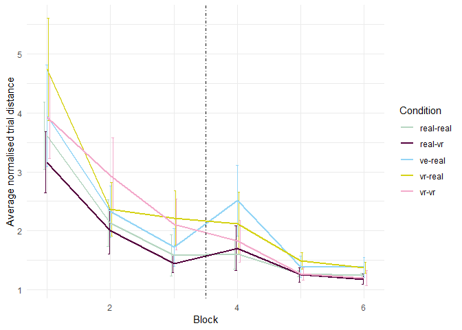
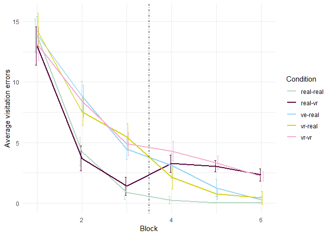
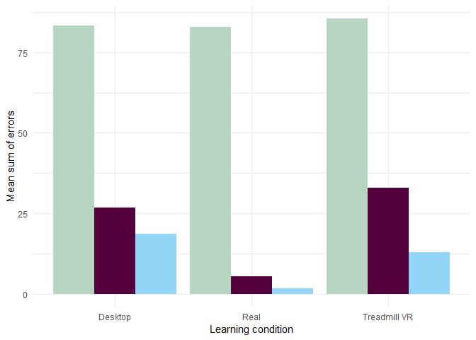
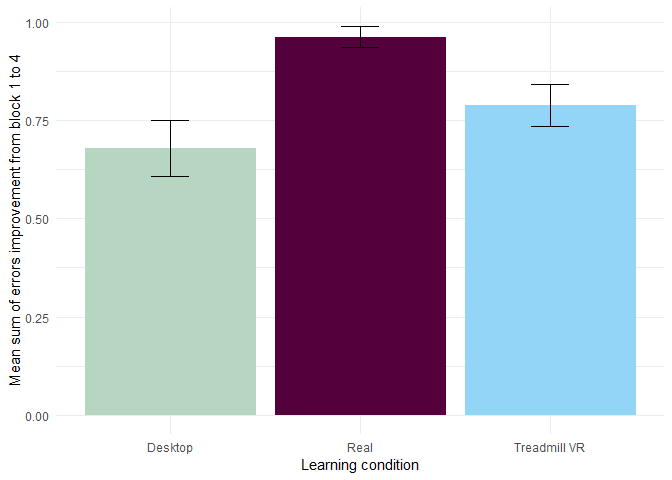
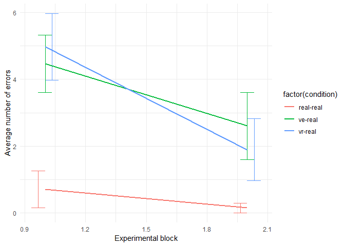

Transfer report
================
Lukáš 'hejtmy' Hejtmánek
4 June 2018

Per phase separation
--------------------

PER BLOCK
---------

Pointing
--------

 \#\# Sum of errors

Measure of overall sum of errors. Mean columns define mean sum of errors for all participants in that block

| learning.condition |  block1.mean|  block3.mean|  block4.mean|  block34.diff|  block34.se|  block14.diff|  block14.se|
|:-------------------|------------:|------------:|------------:|-------------:|-----------:|-------------:|-----------:|
| Desktop            |     83.31579|    26.789474|    18.684210|     0.3896903|   0.0890157|     0.6801146|   0.0711650|
| Real               |     82.90909|     5.454546|     1.590909|     0.8607021|   0.0679299|     0.9632893|   0.0268788|
| Treadmill VR       |     85.50000|    32.850000|    12.800000|     0.6195643|   0.0792096|     0.7899438|   0.0538944|

Normalised distance
-------------------

Measure of mean distance. First three columns define mean normalised distance in each block.

| learning.condition |  block1.mean|  block3.mean|  block4.mean|  block34.diff|  block34.se|  block14.diff|  block14.se|
|:-------------------|------------:|------------:|------------:|-------------:|-----------:|-------------:|-----------:|
| Desktop            |     3.947872|     1.722262|     2.427133|    -0.1253561|   0.0729458|     0.2389973|   0.0721084|
| Real               |     3.308835|     1.382138|     1.530321|    -0.0514270|   0.0296911|     0.3464442|   0.0453461|
| Treadmill VR       |     4.457657|     2.161947|     2.117841|     0.0128666|   0.0527691|     0.3390977|   0.0589867|

Stats
=====

Block T tests
-------------

Paired block comparisons for improvement in different condiutions

### Block 1-4

Paired t tests between min normalised distance difference in blocks 1 and 4.

| condition    |     estimate|  statistic|    p.value|  parameter|  conf.low|  conf.high| method        | alternative |
|:-------------|------------:|----------:|----------:|----------:|---------:|----------:|:--------------|:------------|
| real-real    |     1.947895|   8.126597|  0.0000001|         20|  1.447903|   2.447888| Paired t-test | two.sided   |
| ve-real      |     2.225610|   4.677051|  0.0001877|         18|  1.225870|   3.225349| Paired t-test | two.sided   |
| vr-real      |     2.295710|   5.332316|  0.0000381|         19|  1.394605|   3.196815| Paired t-test | two.sided   |
| And for numb |  er of error|          s|           |           |          |           |               |             |

| condition |   estimate|  statistic|  p.value|  parameter|   conf.low|  conf.high| method        | alternative |
|:----------|----------:|----------:|--------:|----------:|----------:|----------:|:--------------|:------------|
| real-real |  12.909091|  16.380577|    0e+00|         21|  11.270203|   14.54798| Paired t-test | two.sided   |
| ve-real   |   9.421053|   8.394127|    1e-07|         18|   7.063107|   11.77900| Paired t-test | two.sided   |
| vr-real   |   8.775000|  11.168682|    0e+00|         19|   7.130555|   10.41945| Paired t-test | two.sided   |

### Block 3-4

Paired t tests between min normalised distance difference in blocks 3 and 4.

| condition |    estimate|   statistic|    p.value|  parameter|    conf.low|  conf.high| method        | alternative |
|:----------|-----------:|-----------:|----------:|----------:|-----------:|----------:|:--------------|:------------|
| real-real |  -0.1481832|  -1.1666069|  0.2564469|         21|  -0.4123373|  0.1159708| Paired t-test | two.sided   |
| ve-real   |  -0.7048706|  -1.7923125|  0.0899076|         18|  -1.5311094|  0.1213682| Paired t-test | two.sided   |
| vr-real   |   0.0441062|   0.1566285|  0.8771900|         19|  -0.5452841|  0.6334965| Paired t-test | two.sided   |

And for number of errors

| condition |   estimate|  statistic|    p.value|  parameter|   conf.low|  conf.high| method        | alternative |
|:----------|----------:|----------:|----------:|----------:|----------:|----------:|:--------------|:------------|
| real-real |  0.6439394|   2.559690|  0.0182545|         21|  0.1207725|   1.167106| Paired t-test | two.sided   |
| ve-real   |  1.3508772|   2.436782|  0.0254278|         18|  0.1861905|   2.515564| Paired t-test | two.sided   |
| vr-real   |  3.3416667|   5.966635|  0.0000096|         19|  2.1694500|   4.513883| Paired t-test | two.sided   |

### Block 1-4

Paired t tests between min normalised distance difference in blocks 1 and 4.

| condition    |     estimate|  statistic|    p.value|  parameter|   conf.low|  conf.high| method        | alternative |
|:-------------|------------:|----------:|----------:|----------:|----------:|----------:|:--------------|:------------|
| real-real    |     1.781306|   6.130112|  0.0000054|         20|  1.1751603|   2.387451| Paired t-test | two.sided   |
| ve-real      |     1.520739|   3.299164|  0.0039887|         18|  0.5523257|   2.489152| Paired t-test | two.sided   |
| vr-real      |     2.339816|   4.684741|  0.0001614|         19|  1.2944454|   3.385187| Paired t-test | two.sided   |
| And for numb |  er of error|          s|           |           |           |           |               |             |

| condition |  estimate|  statistic|  p.value|  parameter|   conf.low|  conf.high| method        | alternative |
|:----------|---------:|----------:|--------:|----------:|----------:|----------:|:--------------|:------------|
| real-real |  13.55303|  16.871461|    0e+00|         21|  11.882454|   15.22361| Paired t-test | two.sided   |
| ve-real   |  10.77193|   8.716213|    1e-07|         18|   8.175506|   13.36835| Paired t-test | two.sided   |
| vr-real   |  12.11667|  16.957736|    0e+00|         19|  10.621156|   13.61218| Paired t-test | two.sided   |

### Block 1-6

Paired t tests between min normalised distance difference in blocks 1 and 6.

| condition |  estimate|  statistic|  p.value|  parameter|  conf.low|  conf.high| method        | alternative |
|:----------|---------:|----------:|--------:|----------:|---------:|----------:|:--------------|:------------|
| real-real |  2.069267|   8.578768|  0.0e+00|         20|  1.566116|   2.572418| Paired t-test | two.sided   |
| ve-real   |  2.640617|   6.472810|  4.3e-06|         18|  1.783535|   3.497699| Paired t-test | two.sided   |
| vr-real   |  3.230200|   7.471135|  6.0e-07|         18|  2.321851|   4.138549| Paired t-test | two.sided   |

And for number of errors

| condition |  estimate|  statistic|  p.value|  parameter|  conf.low|  conf.high| method        | alternative |
|:----------|---------:|----------:|--------:|----------:|---------:|----------:|:--------------|:------------|
| real-real |  13.78030|   18.56191|        0|         21|  12.23640|   15.32420| Paired t-test | two.sided   |
| ve-real   |  13.57895|   14.64365|        0|         18|  11.63078|   15.52712| Paired t-test | two.sided   |
| vr-real   |  13.80000|   21.50907|        0|         19|  12.45714|   15.14286| Paired t-test | two.sided   |

Independent block improvement comparisons between conditions for distance
-------------------------------------------------------------------------

### Block 1-4 improvement

| Comparison        |  mean.first|  mean.second|    p.value|
|:------------------|-----------:|------------:|----------:|
| Desktop - real    |  -0.2006440|   -0.3444842|  0.1514791|
| Treadmil - real   |  -0.3152113|   -0.3444842|  0.7041065|
| Treadmil- Desktop |  -0.3152113|   -0.2006440|  0.2722008|

### Block 3-4 improvement

| Comparison        |  mean.first|  mean.second|    p.value|
|:------------------|-----------:|------------:|----------:|
| Desktop - real    |   0.1253561|    0.0514270|  0.3572766|
| Treadmil - real   |  -0.0128666|    0.0514270|  0.2967233|
| Treadmil- Desktop |  -0.0128666|    0.1253561|  0.1342036|

Independent block improvement comparisons between conditions for number of errors
---------------------------------------------------------------------------------

### Block 1-4 improvement

| Comparison        |  mean.first|  mean.second|    p.value|
|:------------------|-----------:|------------:|----------:|
| Desktop - real    |  -0.6065031|   -0.9268407|  0.0000562|
| Treadmil - real   |  -0.6421871|   -0.9268407|  0.0000038|
| Treadmil- Desktop |  -0.6421871|   -0.6065031|  0.6308941|

### Block 3-4 improvement

| Comparison        |  mean.first|  mean.second|    p.value|
|:------------------|-----------:|------------:|----------:|
| Desktop - real    |  -0.3896903|   -0.8607021|  0.0007781|
| Treadmil - real   |  -0.6195643|   -0.8607021|  0.0518405|
| Treadmil- Desktop |  -0.6195643|   -0.3896903|  0.0615618|

Anova
-----

Simple between subjects anova

|                                   |    Df|      Sum Sq|      Mean Sq|     F value|  Pr(&gt;F)|
|-----------------------------------|-----:|-----------:|------------:|-----------:|----------:|
| exp\_block\_id                    |     1|  1065.02676|  1065.026765|  205.201439|  0.0000000|
| learning.condition                |     2|    61.91766|    30.958832|    5.964918|  0.0026193|
| exp\_block\_id:learning.condition |     2|    22.76192|    11.380962|    2.192799|  0.1119080|
| Residuals                         |  1764|  9155.42903|     5.190152|          NA|         NA|

### Normalised distance

Within subjects anova for block 3-4 difference.

<table class="kable_wrapper">
<tbody>
<tr>
<td>
|     | Effect                            |  DFn|  DFd|         F|          p| p&lt;.05 |        ges|
|-----|:----------------------------------|----:|----:|---------:|----------:|:---------|----------:|
| 2   | learning.condition                |    2|   58|  6.652379|  0.0025060| \*       |  0.1096784|
| 3   | exp\_block\_id                    |    1|   58|  2.832637|  0.0977427|          |  0.0221110|
| 4   | learning.condition:exp\_block\_id |    2|   58|  1.886117|  0.1608444|          |  0.0292310|

</td>
</tr>
</tbody>
</table>

Within subjects anova for block 1-4 difference in minimal path.

<table class="kable_wrapper">
<tbody>
<tr>
<td>
|     | Effect                            |  DFn|  DFd|           F|          p| p&lt;.05 |        ges|
|-----|:----------------------------------|----:|----:|-----------:|----------:|:---------|----------:|
| 2   | learning.condition                |    2|   57|   4.7875237|  0.0119690| \*       |  0.0805653|
| 3   | exp\_block\_id                    |    1|   57|  59.5077079|  0.0000000| \*       |  0.3330743|
| 4   | learning.condition:exp\_block\_id |    2|   57|   0.9668416|  0.3864303|          |  0.0159693|

</td>
</tr>
</tbody>
</table>

### Number of errors

Within subjects anova for block 1-4 number of errors.

<table class="kable_wrapper">
<tbody>
<tr>
<td>
|     | Effect                            |  DFn|  DFd|           F|          p| p&lt;.05 |        ges|
|-----|:----------------------------------|----:|----:|-----------:|----------:|:---------|----------:|
| 2   | learning.condition                |    2|   57|    2.846774|  0.0663105|          |  0.0460987|
| 3   | exp\_block\_id                    |    1|   57|  253.898477|  0.0000000| \*       |  0.6969041|
| 4   | learning.condition:exp\_block\_id |    2|   57|    1.703376|  0.1912041|          |  0.0299280|

</td>
</tr>
</tbody>
</table>

Within subjects anova for block 3-4 number of errors.

<table class="kable_wrapper">
<tbody>
<tr>
<td>
|     | Effect                   |  DFn|  DFd|          F|          p| p&lt;.05 |        ges|
|-----|:-------------------------|----:|----:|----------:|----------:|:---------|----------:|
| 2   | condition                |    2|   58|  9.7812233|  0.0002185| \*       |  0.1793309|
| 3   | exp\_block\_id           |    1|   58|  5.6678041|  0.0205845| \*       |  0.0332652|
| 4   | condition:exp\_block\_id |    2|   58|  0.4700672|  0.6273202|          |  0.0056753|

</td>
</tr>
</tbody>
</table>

Office specific learning
------------------------

    ##   learning.condition block2 block3 block4 block5 block6
    ## 1            Desktop  -0.23   0.24   0.39   0.39   0.39
    ## 2               Real   0.10   0.08   0.34   0.40   0.13
    ## 3       Treadmill VR  -0.08   0.27   0.32   0.26   0.13

    ##   learning.condition block2 block3 block4 block5 block6
    ## 1            Desktop  -0.04   0.33  -0.04   0.00   0.12
    ## 2               Real   0.08  -0.04   0.08   0.15   0.00
    ## 3       Treadmill VR  -0.01   0.07   0.04   0.01   0.06
