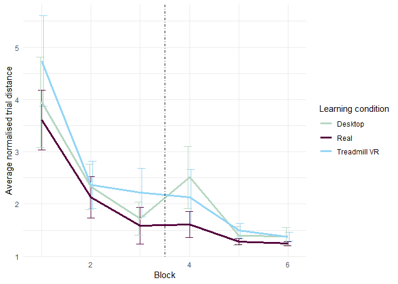
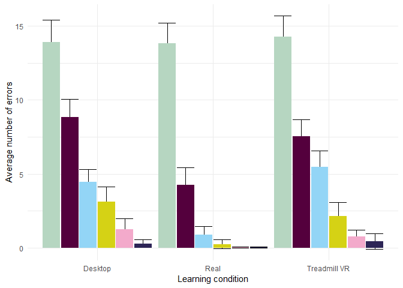

R Notebook
================

Methods
=======

Measures
--------

We calculated participants’ walked distance in the building, time spent in each task and number of incorrectly visited doors. The conditions were not perfectly comparable in their measured distance and time, with the VR trials taking a little bit longer in both time and distance than the real world condition. We therefore min-normalised the distance traveled and the time for each task and environment by dividing the measure by any participant's performance for that trial. We calculated all statistics on these normalised measures.

There was no difference between conditions at the start of the experiment in normalised distance (*F*(2, 334)=2.11, *M**S**E* = 18.07, *p* = .123), nor in number errors (*F*(2, 363)=0.10, *M**S**E* = 64.52, *p* = .903), but there is a significant difference in normalised time (*F*(2, 363)=28.57, *M**S**E* = 24.22, *p* &lt; .001)), due to VR taking longer times to get used to (and therefore having longer normalised trial times at the start).

Participants
------------

A total of 61 (M = 20.4, SD = 2.2) undergraduate students at UC Davis particiapted in the study in exchange for a study credit. Each students was randomly assigned a condition and a randomised set of goals. 18 participants didn't finish due to motion sickness and 3 were removed due to a technical failure of the real world tracking systen. Only 58 percent the students being able to finish VR to Real world condition.

Results
=======

First we wanted to assess that there is going to be some level of transfer in all conditions. If we would assume no transfer to happen, we should observe same performance in the real world testing in 1st, 2nd and 3rd block after the switch to be similar in performance as the 1st, 2nd and 3rd block in the real world learning group. But all conditions (except desktop in distance) show better performance after the switch (see table XXX) than in the first trial, suggesting some level of transfer happening in all learning conditions.

| Learning condition | Distance improvement                                                         | Errors improvement                                                               |
|:-------------------|:-----------------------------------------------------------------------------|:---------------------------------------------------------------------------------|
| Real               | *M**d* = 1.93, 95% CI \[1.19, 2.67\], *t*(20)=5.43, *p* &lt; .001 | *M**d* = 13.55, 95% CI \[11.88, 15.22\], *t*(21)=16.87, *p* &lt; .001 |
| Desktop            | *M**d* = 1.09, 95% CI \[ − 0.10, 2.29\], *t*(18)=1.93, *p* = .070 | *M**d* = 10.77, 95% CI \[8.18, 13.37\], *t*(18)=8.72, *p* &lt; .001   |
| Treadmill VR       | *M**d* = 2.49, 95% CI \[1.45, 3.53\], *t*(19)=5.00, *p* &lt; .001 | *M**d* = 12.12, 95% CI \[10.62, 13.61\], *t*(19)=16.96, *p* &lt; .001 |

Looking at the progression in distance improvements and error improvements over the course of the experiment, we can see that all conditions show progressive improvement which is only hindered by the switch in the desktop learning condition (see fig. XXX and fig. XXX), but in the Treadmill condition we see constant improvement unobstructed by the environmrnt switch. 

Participant's performance in the first pre-switch phase shows different rates of learning rate (see table XX). There is no significant difference between different modalities in distance performance before the switch *F*(2, 321)=2.88, *M**S**E* = 4.24, *p* = .058, $\\hat{\\eta}^2\_G = .018$, but the performance across groups differs in errors *F*(2, 363)=32.63, *M**S**E* = 22.37, *p* &lt; .001, $\\hat{\\eta}^2\_G = .152$.

| Predictor                              | Significance for distance improvement | Significance for error improvement |
|:---------------------------------------|:--------------------------------------|:-----------------------------------|
| Intercept                              | p &lt; .001                           | p &lt; .001                        |
| Block number                           | p &lt; .001                           | p &lt; .001                        |
| Learning condition                     | p = 0.18                              | p = 0.65                           |
| Block - Learning condition interaction | p = 0.72                              | p &lt; .001                        |

### After modality switch performance change

Anova doesn't show a significant difference between groups in the pre-switch block (*F*(2, 321)=2.88, *M**S**E* = 4.24, *p* = .058), but there is a significant difference between distance performance in the post-switch block (*F*(2, 295)=3.86, *M**S**E* = 5.50, *p* = .022).

After the modality switch, we can see a significant difference between distance performance (*F*(2, 295)=3.86, *M**S**E* = 5.50, *p* = .022) and errors as well (*F*(2, 363)=13.15, *M**S**E* = 19.79, *p* &lt; .001), with groups learning on the treadmill or desktop performing worse than those learning in the real world. This difference among conditions post-switch is still apparent in the 2nd block after the switch in number of errors *F*(2, 363)=6.75, *M**S**E* = 6.86, *p* = .001, $\\hat{\\eta}^2\_G = .036$ and marginally in distance *F*(2, 256)=2.87, *M**S**E* = 0.37, *p* = .058, $\\hat{\\eta}^2\_G = .022$, but disappears in the last testing block for both errors *F*(2, 363)=1.67, *M**S**E* = 3.33, *p* = .191, $\\hat{\\eta}^2\_G = .009$ and distance *F*(2, 258)=1.95, *M**S**E* = 0.28, *p* = .144, $\\hat{\\eta}^2\_G = .015$.

Mixed effect models with individual random effect also show significant effect of the of the learning condition on rate of improvement from pre-switch to post-switch block (See table XXX ).

| Predictor                              | Significance for distance improvement | Significance for error improvement |
|:---------------------------------------|:--------------------------------------|:-----------------------------------|
| Intercept                              | p = 0.4                               | p &lt; .001                        |
| Block number                           | p &lt; .001                           | p &lt; .0.05                       |
| Learning condition                     | p = 0.08                              | p &lt; .001                        |
| Block - Learning condition interaction | p = 0.05                              | p &lt; .001                        |

Running separate pairwise t-tests to see individual performance change from pre-switch to post-switch block, we see significant improvement in errors made across all conditions, and marginally significant worsening in distance performance in the desktop condition.

| Learning condition | Distance improvement                                                             | Errors improvement                                                           |
|:-------------------|:---------------------------------------------------------------------------------|:-----------------------------------------------------------------------------|
| Real               | *M**d* = −0.02, 95% CI \[ − 0.26, 0.23\], *t*(21)= − 0.16, *p* = .876 | *M**d* = 0.64, 95% CI \[0.12, 1.17\], *t*(21)=2.56, *p* = .018    |
| Desktop            | *M**d* = −1.13, 95% CI \[ − 2.29, 0.02\], *t*(18)= − 2.06, *p* = .054 | *M**d* = 1.35, 95% CI \[0.19, 2.52\], *t*(18)=2.44, *p* = .025    |
| Treadmill VR       | *M**d* = −0.03, 95% CI \[ − 0.59, 0.53\], *t*(19)= − 0.11, *p* = .910 | *M**d* = 3.34, 95% CI \[2.17, 4.51\], *t*(19)=5.97, *p* &lt; .001 |

We can see that all participants improved in the errors made, but neigher group is significantly worse in the post-switch block in the path travelled (although participants who learned on the desktop performed slightly worse, but the significance is only marginal).

### Personal

To assess the level of performance change form directly before and after the switch, we calculated a score personal improvement as (block3-block4)/(block3+block4)´. This allowed us to directly comapre the percentual improvement or deterioration from pre-switch block to the post-switch one.

Comparing the perfomance change in different conditions using anovas, we see marginally significant difference between groups in the distance improvement (*F*(2, 58)=2.77, *M**S**E* = 0.06, *p* = .071), but significant differences in error rate improvement (*F*(2, 49)=6.72, *M**S**E* = 0.13, *p* = .003). This is consistent with the mixed model result which poited at interaction between block and learning condition.

Tukey post-hoc tests show significant difference between error rate improvement between the group that leardned in the real world and that which learned on the desktop.

|                      |        diff| p-value     |
|----------------------|-----------:|:------------|
| Real-Desktop         |   0.4710119| p &lt; .001 |
| Treadmill VR-Desktop |   0.2298740| p = 0.12    |
| Treadmill VR-Real    |  -0.2411379| p = 0.15    |

### Something about pointing?

Summary
-------

We can see different rates of learning speed across different conditions, with significan differences between groups in their performance after the first phase witt the real world learning group performing the best, but only significanly different from group learning on the desktop. All conditions show some level of transfer, demonstrated both by general improvement from the first block to the fourth, as well as decreased errors in desktop and treadmill VR group after the switch to the real environment.
