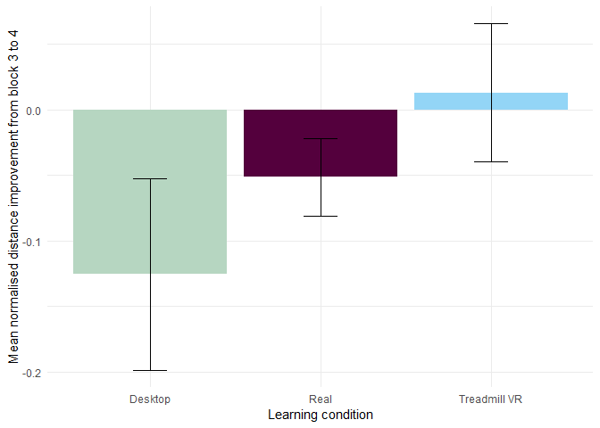
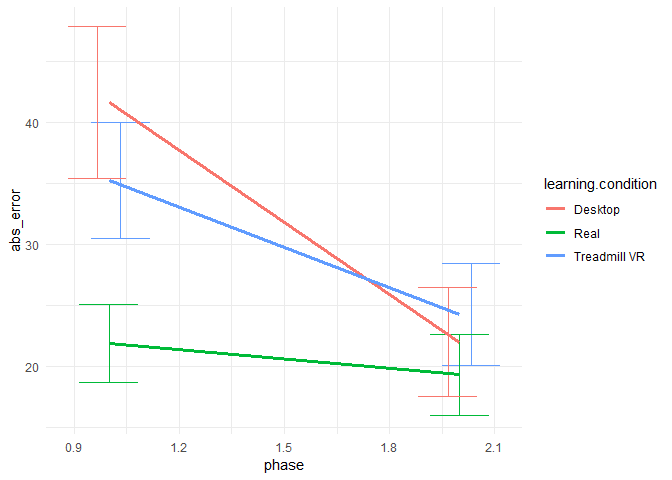

R Notebook
================

Methods
=======

Measures
--------

We calculated participants’ walked distance in the building, time spent in each task, number of incorrectly visited doors during walking trials and pointing precision during pointing trials. The conditions were not perfectly comparable in measured distance and time, with the VR trials taking a little bit longer in both time and distance than the real world condition. We therefore min-normalised the distance traveled and the time for each task and environment by dividing the measure by any participant's best performance for that trial (therefore the result of 2 in min-normalised distance would mean the participant traveled double the distance than was necessary). We calculated all statistics on these normalised measures.

There was no difference between conditions at the start of the experiment in normalised distance (*F*(2, 323)=1.99, *M**S**E* = 16.13, *p* = .139), nor in number errors (*F*(2, 363)=0.10, *M**S**E* = 64.52, *p* = .903), but we observed a significant difference in normalised time (*F*(2, 363)=28.57, *M**S**E* = 24.22, *p* &lt; .001), due to the treadmill VR participants taking longer times to get used to the device and therefore having longer trial times at the start. We removed distance or time measurements larger than 3 standard deviations from the mean (a total of 1.8 percent of trials).

Participants
------------

A total of 79 undergraduate students at UC Davis (M = 20.4, SD = 2.2) particiapted in the study in exchange for a study credit. 18 participants didn't finish due to motion sickness and 3 were removed due to a technical failure of the real world tracking systen. Only 58 percent the students being able to finish Treadmill VR learning condition. Each students was randomly assigned a condition and a randomised set of goals before arrival.

Results
=======

First we wanted to assess that there was some level of transfer in all conditions. All conditions demonstrate better performance in the post-switch block than in the first block (see table XXX) , suggesting some level of transfer happening in all learning conditions.

| Learning condition | Distance improvement                                                         | Errors improvement                                                               |
|:-------------------|:-----------------------------------------------------------------------------|:---------------------------------------------------------------------------------|
| Real               | *M**d* = 1.78, 95% CI \[1.18, 2.39\], *t*(20)=6.13, *p* &lt; .001 | *M**d* = 13.55, 95% CI \[11.88, 15.22\], *t*(21)=16.87, *p* &lt; .001 |
| Desktop            | *M**d* = 1.52, 95% CI \[0.55, 2.49\], *t*(18)=3.30, *p* = .004    | *M**d* = 10.77, 95% CI \[8.18, 13.37\], *t*(18)=8.72, *p* &lt; .001   |
| Treadmill VR       | *M**d* = 2.34, 95% CI \[1.29, 3.39\], *t*(19)=4.68, *p* &lt; .001 | *M**d* = 12.12, 95% CI \[10.62, 13.61\], *t*(19)=16.96, *p* &lt; .001 |

Looking at the progression of distance and error rate performance over the course of the experiment, we can see that all conditions show incremental improvement which is only hindered by the switch in the desktop learning condition (see fig. XXX and fig. XXX), but in the Treadmill VR condition we see constant improvement unobstructed by the environment switch. 

Participant's performance in the first pre-switch phase shows different rates of learning rate, demonstrated by an interaction between block bumber and learning condition for error rate performance (see table XX).

**this is a mixed model with id/block id random term. Significance was measured with Anova from car package, but I read it is not a good way to measure significance and we shouldn't even use significance in mixed models. I'll check on past cognition papers to see how and if they do it.**

| Predictor                              | Significance for distance improvement | Significance for error improvement |
|:---------------------------------------|:--------------------------------------|:-----------------------------------|
| Intercept                              | p &lt; .001                           | p &lt; .001                        |
| Block number                           | p &lt; .001                           | p &lt; .001                        |
| Learning condition                     | p = 0.25                              | p = 0.65                           |
| Block - Learning condition interaction | p = 0.84                              | p &lt; .001                        |

### Performance change after modality switch

We found significant difference between different modalities in the pre-switch block in distance performance (*F*(2, 315)=4.18, *M**S**E* = 3.54, *p* = .016), and the error rate as well (*F*(2, 363)=32.63, *M**S**E* = 22.37, *p* &lt; .001). We also obseved a difference between conditions in their pointing performance at the end of the first phase (*F*(2, 729)=17.78, *M**S**E* = 1, 412.53, *p* &lt; .001), with real group performing significantly better than the Treadmill VR group (*Δ*angle error = 13.3, p &lt; .001) and the Desktop group (*Δ*angle error = -19.69, p &lt; .001).

Mixed effect models with individual random effect show significant effect of the of the learning condition on rate of improvement from pre-switch to post-switch block (See table XXX).

| Predictor                              | Significance for distance improvement | Significance for error improvement |
|:---------------------------------------|:--------------------------------------|:-----------------------------------|
| Intercept                              | p = 0.73                              | p &lt; .001                        |
| Block number                           | p = 0.07                              | p &lt; .0.05                       |
| Learning condition                     | p = 0.17                              | p &lt; .001                        |
| Block - Learning condition interaction | p = 0.22                              | p &lt; .001                        |

Running separate pairwise t-tests to see individual performance change from pre-switch to post-switch block, we see significant improvement in errors made across all conditions, and marginally significant worsening in distance performance in the desktop condition.

| Learning condition | Distance improvement                                                             | Errors improvement                                                           |
|:-------------------|:---------------------------------------------------------------------------------|:-----------------------------------------------------------------------------|
| Real               | *M**d* = −0.15, 95% CI \[ − 0.41, 0.12\], *t*(21)= − 1.17, *p* = .256 | *M**d* = 0.64, 95% CI \[0.12, 1.17\], *t*(21)=2.56, *p* = .018    |
| Desktop            | *M**d* = −0.70, 95% CI \[ − 1.53, 0.12\], *t*(18)= − 1.79, *p* = .090 | *M**d* = 1.35, 95% CI \[0.19, 2.52\], *t*(18)=2.44, *p* = .025    |
| Treadmill VR       | *M**d* = 0.04, 95% CI \[ − 0.55, 0.63\], *t*(19)=0.16, *p* = .877     | *M**d* = 3.34, 95% CI \[2.17, 4.51\], *t*(19)=5.97, *p* &lt; .001 |

We can see that all participants improved in the number of errors made, but neigher group is significantly worse or better in the post-switch block in the path travelled (although participants who learned on the desktop performed slightly worse, the significance is only marginal).

### Performance change

To assess the level of performance change form directly before and after the switch, we calculated personal improvement score as (block3-block4)/(block3+block4)´. This allowed us to directly comapre the relative improvement or deterioration from pre-switch block to the post-switch one.

Comparing the perfomance change in different conditions using ANOVA, we see marginally significant difference between groups in the distance improvement (*F*(2, 58)=1.64, *M**S**E* = 0.06, *p* = .202), but significant differences in error rate improvement (*F*(2, 49)=6.72, *M**S**E* = 0.13, *p* = .003). This is consistent with the mixed model result which pointed at an interaction between block number and learning condition.

Tukey post-hoc tests show significant difference between error rate improvement between the group that learned in the real world and that which learned on the desktop.

|                      |        diff| p-value     |
|----------------------|-----------:|:------------|
| Real-Desktop         |   0.4710119| p &lt; .001 |
| Treadmill VR-Desktop |   0.2298740| p = 0.12    |
| Treadmill VR-Real    |  -0.2411379| p = 0.15    |

### Post Switch performance

In the post-switch block, we can still see a significant difference between groups in their distance performance (*F*(2, 289)=4.04, *M**S**E* = 2.94, *p* = .019) and error rate as well (*F*(2, 363)=13.15, *M**S**E* = 19.79, *p* &lt; .001), with groups learning on the treadmill or desktop performing worse than those learning in the real world. This between group difference is still present in the 2nd block of the second phase (block 5) in error rate *F*(2, 363)=6.75, *M**S**E* = 6.86, *p* = .001 and marginally in distance *F*(2, 253)=5.74, *M**S**E* = 0.18, *p* = .004. In the last testing block (block 6), we found no differences among the groups in either error rate (*F*(2, 363)=1.67, *M**S**E* = 3.33, *p* = .191), nor pointing performance (*F*(2, 726)=1.56, *M**S**E* = 982.05, *p* = .210) but we still see small difference in distance performance (*F*(2, 255)=3.21, *M**S**E* = 0.10, *p* = .042).

### Improvement from the pre-switch block to the final block

Assuming the performance platoes around the 6the block, looking at participants performance in the pre-switch block and the last block we can deduce what margin of improvement is still possible. We see that participants learning in the real world no longer improve in error rate after the 3rd block *t*(21)=1.26, *p* = .223, but they are continuously improving in distance performance *t*(21)=2.88, *p* = .009.

*Not sure about the mixed models here. I think they are OK, but I haven't published anything with them before*

Looking at the linear mixed model prediction for the distance and error improvement in the second phase (post-switch), we can see that both learning condition and interaction with the experiment progression is significant, showing that there are different learning rates for different learning conditions even after the switch to the real world.

| Predictor                              | Significance for distance improvement | Significance for error improvement |
|:---------------------------------------|:--------------------------------------|:-----------------------------------|
| Intercept                              | p &lt; .001                           | p &lt; .001                        |
| Block number                           | p &lt; .001                           | p &lt; .001                        |
| Learning condition                     | p &lt; .001                           | p &lt; .001                        |
| Block - Learning condition interaction | p &lt; .0.05                          | p &lt; .001                        |

Summary
-------

We can see different rates of learning speed across different conditions, with significant differences between groups in their performance in the post-switch block. Participants learning in the real world are performing the best after the switch, but only significanly different from the group learning on the desktop. All conditions show some level of transfer, demonstrated both by general improvement from the first block to the fourth, as well as decreased errors in desktop and treadmill VR group after the switch to the real environment. All groups get to the same level of performance after the three blocks post-switch moving in the real world, not differing in errors made nor in distance in the last block. But we also observed that whilst real world training leads to almost perfect performance in the pre-switch block, not differing from the last block in error rate and only slightly in distance. It takes another 3 blocks in the real world for the groups which learned on the treadmill or the desktop to achieve same performance, again pointing to qualitative difference between different modalities.

*I am unsure if it is worth adding the rest of the dataset in (the VR - VR and real - VR groups), but the performance of Treadmill VR groups in the distance traveled gets exactly to the same level as the real world performance in the 6th block (so the VR - VR group performs the same after the 6 blocks as VR - real and real - VR). Which is nice comparison to the results we get here about the distance performance in the real world being almost perfect in the 3rd block and the rest of the groups slowly "getting there".*

*The VR groups still demonstrate larger error difference in the 4-6th block, making more errors overall than the real world groups (about 2 errors per trial more). I believe it can be explained by either social difference - participants not wanting to "ask as much" in the real world, or accidental walking into a door due to treadmill control issues. Also, particiapnts told me that the VR is more "inviting" to test all the doors that are being passed (just in case), because it is more tiring to get back to one in case of a mistake. Anyway, not sure it it warranties adding more groups to the study, but at least the data are consistent and distance performance gets to the same level even in the VR*

We found difference in relative improvement rate
