Transfer report
================
Lukáš Hejtmánek
9 August 2018

Hypotheses
----------

1.  There will be some transfer in all learning conditions.
2.  Transfer will be higher in the real world learning condition than in desktop condition.
3.  Transfer will be higher in the real world learning condition than in VR treadmill condition.
4.  Transfer will be higher in the VR treadmill condition that in the desktop condition.

-   transfer is operationalised as a change in performance in navigational tasks following the environment/modality switch.

Specific tests

-   Overrall average walking performance in phase 1 vs phase 2
-   Performance in block 4 vs performance in block 1 and 2
-   Overrall average pointing performance in phase 1 vs phase 2
-   Average walking performance in block 3 vs 4 (block directly before vs directly after the switch)
-   Personal walking performance change in block 3 vs 4 (calculated as an average of individuals (block3-block4)/(block3+block4))
-   Personal walking performance change in block 1 vs 4 (calculated as an average of individuals (block1-block4)/(block3+block4))
-   Learning modality has an effect on the learning curve (slope)
-   Level of correlation of personal performance in block 1,2,3 and 4 - higher transfer should show higher correlation in these comparisons
-   Difference in performance between groups in blocks 5 and 6 (e.g. not immediately after the switch, but after all groups have been subjected the real world environment for some time)
-   Difference in performance between groups in block 4-6 with inclusion of VR-VR group nad real-VR group (to see if the final performance is subjected to the necessity of a real world experience, or not and to see if the swith has detrimental effect on real-VR as well).

Controlling analyses
--------------------

1.  Every condition starts on a same level of performance (there isn't a bias in the first block)

Procedure description
---------------------

I ran all tests on the normalised distance, errors are not normalised, as they are the same in all conditions.

I only selected those "important" comparisons - therefore Desktop to Real world, Treadmill VR to real world and Real world to real world. Anovas, mixed models and other comparisons are run only on these. Learning conditions (block 1-3) are the different modalities, and blocks 4-6 are all real world testing.

Descriptives
------------

In normalised distance we can see that people in different conditions start fairly at the same level of performance (difference between learning conditions is not significant *F*(2, 334)=2.11, *M**S**E* = 18.07, *p* = .123). Nor there is significant difference between all 5 starting groups *F*(4, 552)=2.32, *M**S**E* = 15.61, *p* = .056.

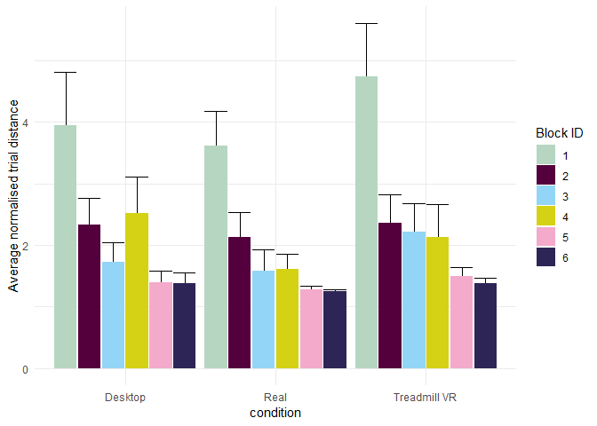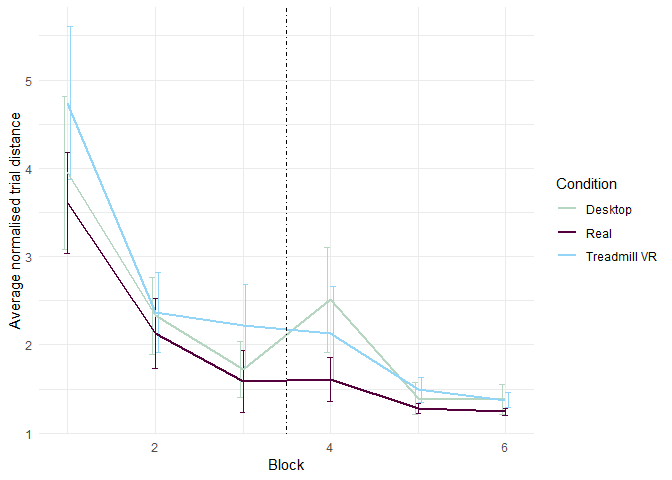

There is difference in normalised times in all conditions in the first block (*F*(2, 363)=28.57, *M**S**E* = 24.22, *p* &lt; .001)). Probably due to learning issues with the treadmill. Threre is no significant difference between desktop and real world learning in normalised times (*t*(219.11)= − 0.98, *p* = .326))

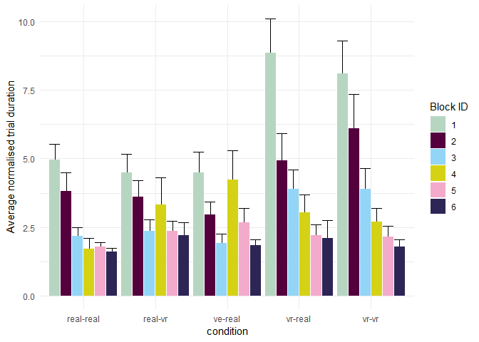

And we don't have any significant difference in number of errors in the first block (*F*(2, 363)=0.10, *M**S**E* = 64.52, *p* = .903)) nor for the all 5 condition (*F*(4, 607)=0.54, *M**S**E* = 66.00, *p* = .710).

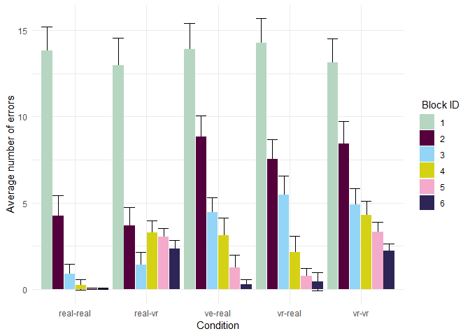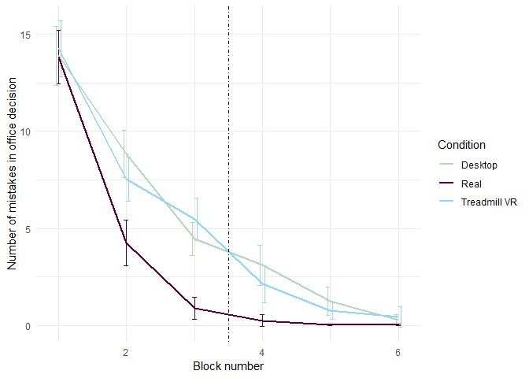

Specific predictions testing
----------------------------

### Performance in block 4 is better than in block 1

If we assume some level of transfer, than the average or individual performance in block 4 should be better in all conditions than in block 1 or potentially in block 2. I don't test for block 3 because that immediately compares the switch performance. 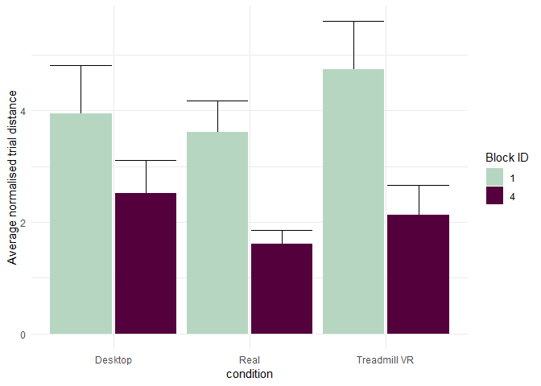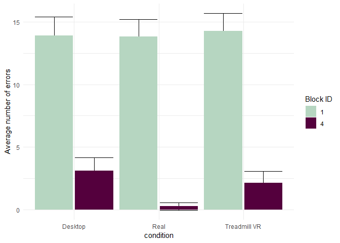

| learning condition | p-value distance improvement | p-value errors improvement |
|:-------------------|:-----------------------------|:---------------------------|
| Desktop            | p = 0.07                     | p &lt; .001                |
| Real               | p &lt; .001                  | p &lt; .001                |
| Treadmill VR       | p &lt; .001                  | p &lt; .001                |

We see that both real world and treadmill VR learning leads to improvement from block 1 to block 4 in both errors and path travelled. But desktop only in number of errors and marginally in distance improvement. All this suggests transfer is happening across all learning conditions.

### Overrall average walking and error performance in phase 1 vs phase 2

Given that all participants had 3 blocks of trials in the second phase done in the real world, We can assume, if one learning method leads to better transfer than another, than the performance improvement between phases could be different as well. 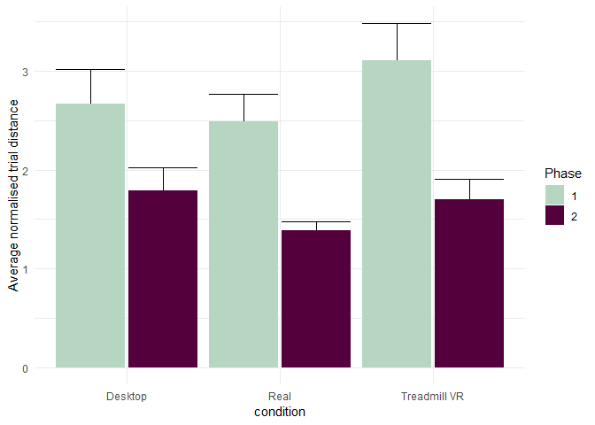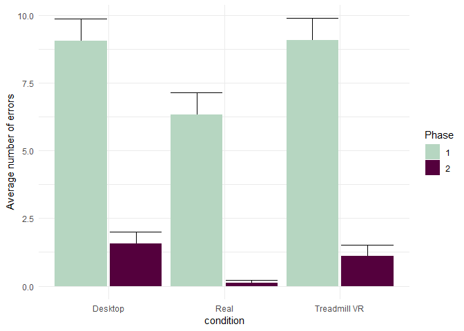

Mixed models show a significant effect of phase on overall performance, but not of their interaction.

|                          |       Chisq|   Df| Pr(&gt;Chisq) |
|--------------------------|-----------:|----:|:--------------|
| (Intercept)              |  118.850075|    1| p &lt; .001   |
| phase                    |   17.131847|    1| p &lt; .001   |
| learning.condition       |    5.609506|    2| p = 0.06      |
| phase:learning.condition |    3.110700|    2| p = 0.21      |

Performance in the second phase differs significantly between groups (*F*(2, 815)=5.51, *M**S**E* = 2.34, *p* = .004), suggesting that the learnign modality has an effect on the overall performance. Tukey test shows significant difference between real adn a desktop versions. although this can be only because of bad performance in block 4 after switch, not due to blocks 5 and 6 (will test later.)

|                      |        diff| p-value      |
|----------------------|-----------:|:-------------|
| Real-Desktop         |  -0.4046038| p &lt; .001  |
| Treadmill VR-Desktop |  -0.0926061| p = 0.77     |
| Treadmill VR-Real    |   0.3119976| p &lt; .0.05 |

### Overrall average pointing performance in phase 1 vs phase 2

The issue with comparing pointing is that people point after learning condition and then only after being subjected to the new condition for 18 trials. Which means that each participant has experienced the real world for half an hour before pointing. As we see laterr, the biggest difference in transfer seems to occur between blocks 3-4, with most participants achieving same performance by the block 6. That means that the comparison of pointing is not very informative.

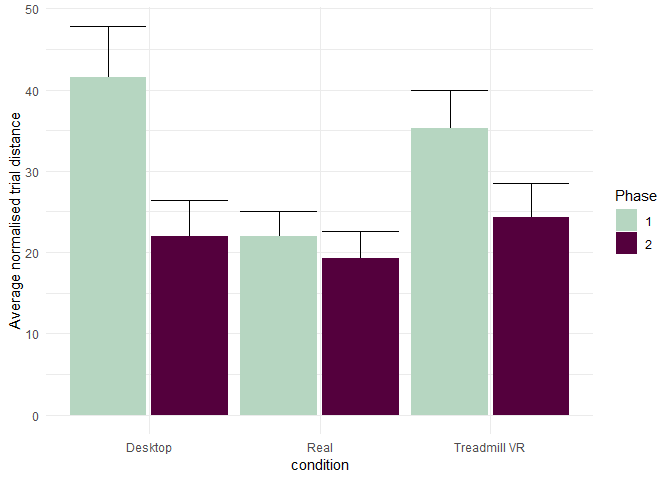

Mixed models show effect of both phase, learning condition and their interaction on pointing performance. Probably due to the fact that participants pointed less acurately on the treadmill and evn less on the desktop, but all then achieved same performance by the end of the 6th block.

|                          |      Chisq|   Df| Pr(&gt;Chisq) |
|--------------------------|----------:|----:|:--------------|
| (Intercept)              |  62.463010|    1| p &lt; .001   |
| phase                    |  18.987245|    1| p &lt; .001   |
| learning.condition       |  12.313850|    2| p &lt; .001   |
| phase:learning.condition |   7.700942|    2| p &lt; .0.05  |

### Comparing walking performance in block 3 vs 4

Looking directly at the performance after the switch, we can see if there is a sudden drop in path length desktop condition. We can study this using paired t.tests as well as non paired t-tests. Looking at the graphs we see differences in the level to which people have learned the environemtn in the 3rd block.

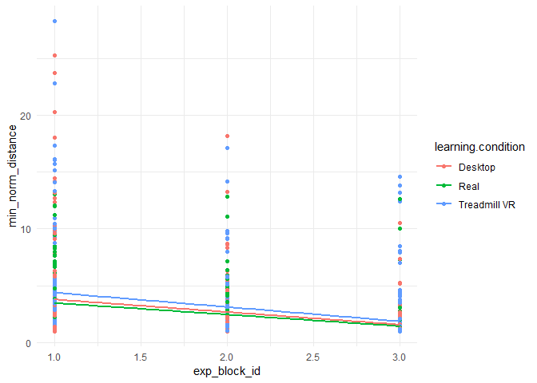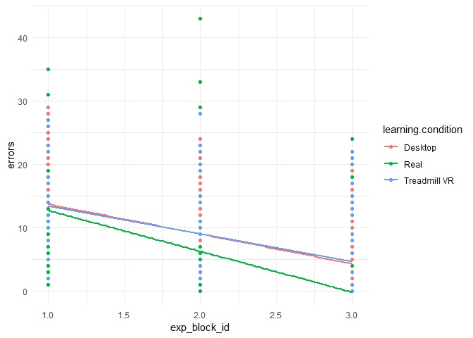

Anova doesn't show shows a significant difference between groups in the block 3 (*F*(2, 321)=2.88, *M**S**E* = 4.24, *p* = .058), but there is a significant difference between distance performance in the block 4 (*F*(2, 295)=3.86, *M**S**E* = 5.50, *p* = .022).

There is significant difference in the number of errors in both block 3 (*F*(2, 363)=32.63, *M**S**E* = 22.37, *p* &lt; .001), and the block 4 (*F*(2, 363)=13.15, *M**S**E* = 19.79, *p* &lt; .001)., with treadmill and desktop performing worse than real world.

Mixed model shows significant effect of both block and its interaction on distance walked.

|                                   |      Chisq|   Df| Pr(&gt;Chisq) |
|-----------------------------------|----------:|----:|:--------------|
| (Intercept)                       |  0.7137935|    1| p = 0.4       |
| exp\_block\_id                    |  8.5252936|    1| p &lt; .001   |
| learning.condition                |  5.1263462|    2| p = 0.08      |
| exp\_block\_id:learning.condition |  5.8334038|    2| p = 0.05      |

And significant effect all both conditoin, block and their interaction on the number of errors.

|                                   |      Chisq|   Df| Pr(&gt;Chisq) |
|-----------------------------------|----------:|----:|:--------------|
| (Intercept)                       |  18.065437|    1| p &lt; .001   |
| exp\_block\_id                    |   5.982441|    1| p &lt; .0.05  |
| learning.condition                |  22.023810|    2| p &lt; .001   |
| exp\_block\_id:learning.condition |  13.908341|    2| p &lt; .001   |

Running separate pairwise t-tests to see individual performance change from block 3 to 4 gives the following results.

| learning condition | p-value distance improvement | p-value errors improvement |
|:-------------------|:-----------------------------|:---------------------------|
| Desktop            | p = 0.05                     | p &lt; .0.05               |
| Real               | p = 0.88                     | p &lt; .0.05               |
| Treadmill VR       | p = 0.91                     | p &lt; .001                |

WE can see that all participants improved in the errors made, but neigher group is significantly worse between block 3 and 4 in the path travelled (although participants learning on desktop perform slightly worse in 4th block, but the significance is only marginal)

### Personal walking performance change in block 3 vs 4

The other approach is using the "performance change" coefficient as you proposed calculated as an average of individual's (block3-block4)/(block3+block4))

Comparing the block perfomance change in different conditions using anovas, we see marginally significant difference in the improvement between groups for distance (*F*(2, 58)=2.77, *M**S**E* = 0.06, *p* = .071).

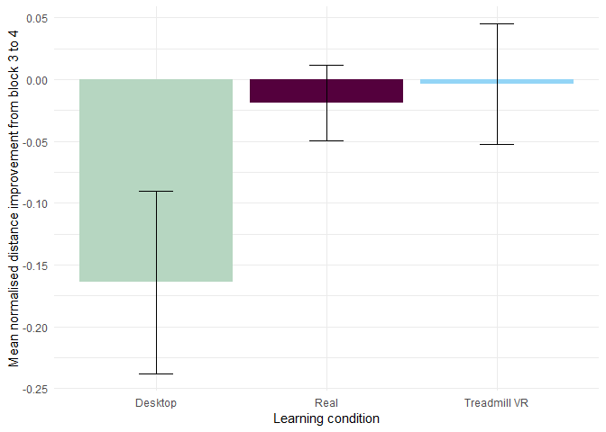

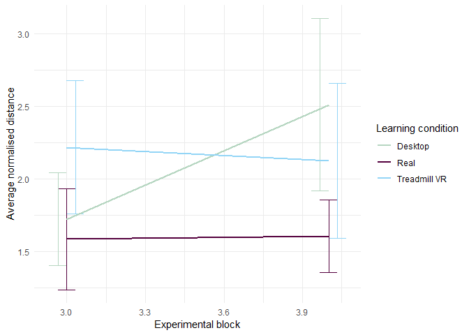

We can see significant differences between different conditions in error rate improvement from block 3 to 4 when running independent anova (*F*(2, 49)=6.72, *M**S**E* = 0.13, *p* = .003).

Post hoc tests show significant difference between Real and Desktop and marginally for Treadmill and Desktop.

|                      |        diff| p-value     |
|----------------------|-----------:|:------------|
| Real-Desktop         |   0.4710119| p &lt; .001 |
| Treadmill VR-Desktop |   0.2298740| p = 0.12    |
| Treadmill VR-Real    |  -0.2411379| p = 0.15    |

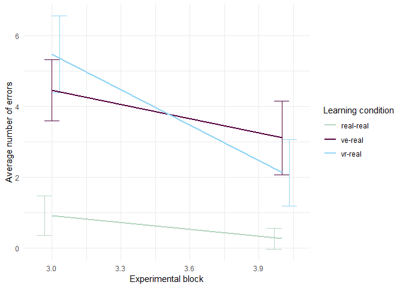

### Personal walking performance change in block 1 vs 4

(calculated as an average of individuals (block1-block4)/(block3+block4))

Anova shows no significant difference in the improvement between groups for distance (*F*(2, 57)=2.01, *M**S**E* = 0.08, *p* = .144). This might be due to quite large variability in the sample.

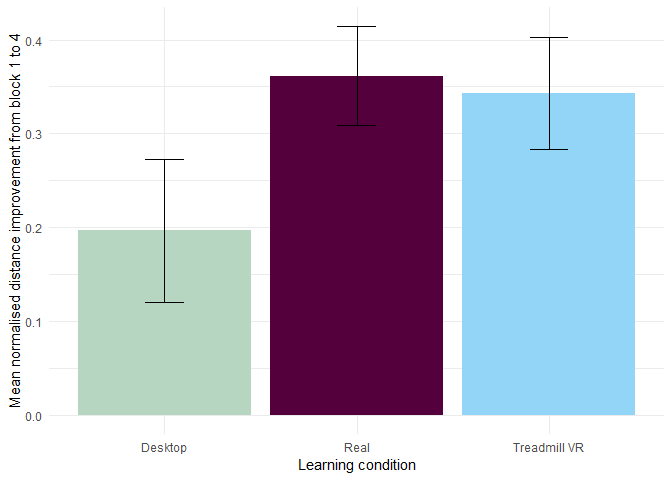

But it reveals significant difference between learning conditions in number of errors improvement from block 1 to block 4 (*F*(2, 58)=7.70, *M**S**E* = 0.05, *p* = .001).

Runnign Tukey's post hoc on the distance shows that this is originating from the difference between Desktop and the Real world, with Treadmill not being significantly different from either of them.

|                      |        diff| p-value     |
|----------------------|-----------:|:------------|
| Real-Desktop         |   0.2831747| p &lt; .001 |
| Treadmill VR-Desktop |   0.1098292| p = 0.31    |
| Treadmill VR-Real    |  -0.1733455| p = 0.05    |

### Learning modality has an effect on the learning curve (slope)

I hope mike or professor Ferer will help with this

### Level of correlation of personal performance in block 1,2,3 and 4

This is a bit weird way of comparing things and it should be somewhat duplicit to the mixed models, but we can measure how much performance from 3-3 correlates between different conditions. I don't know if it isn't actually measured in the mixed models, Mike should know this better.

Table for

| Learning condition |  Correlation of normalised distance|  Correlation of number of errors|
|:-------------------|-----------------------------------:|--------------------------------:|
| Desktop            |                                0.09|                             0.73|
| Real               |                                0.75|                             0.56|
| Treadmill VR       |                                0.42|                             0.63|

I don't know how to interpret this properly, but it looks as the data before suggested - that the least correlation is between desktop in 3rd block and real in 4th. whereas in real to real, the performance correlates very well. The number of errors seems to improve in all cases, so that is why we see medium correlation is across the board.

### Difference in performance between groups in blocks 5 and 6

Not sure if this is interesting or we should focus mainly on the slope analyses.

### Difference in performance between groups in block 4-6 with inclusion of VR-VR group and real-VR group

And here I am not sure if the inclusion of the other groups affects the results in some way - especially in mixed models, Mike said we should pick a model and stick with it. I have an intuition in how to use the other groups to "confirm" or elaborate on our results, but I am unsure how to formulate it or how specifically to run the analyses.

Summary
-------

We see effect of learning condition (blocks 1-3) on performance in block 4 by t-tests in all conditions separately.

We see positive improvement in distance from block 1 to 4 in all conditions and this improvement is not significantly different across learning groups. We see similar improvement in number of errors, but Desktop improves significantly worse than real world training.

We see improvement from phase 1-2 in both walking, errors and pointing precision.

Participant's performance in distance from block 3-4 gets slightly worse after the switch distance-wise (but not significanly).

number of errors decreases (improves) across all conditions., but desktop learning shows least amount of improvement from block 3-4 and 1-4, participants doing significantly worse than those with real world training and marginally worse than those with Treadmill training. It may mean that they know which door are correct, but they are unsure in how to get to them, showing some level of memory transfer, but not necessarily spatial knowledge transfer.

Only desktop shows worse distance performance in block 4 (marginal significance),. treadmil-real and real-real stays relatively the same (good transfer - not improvement).

There is a significant effect in mixed models of learning condition and interaction on distance (marginal effect of learning condition) and errors from block 3-4.

Personal distance performance in blocks 3 and 4 in real world and treadmil doesn't correlate much, but real to real does. Correlation of error performance is similar across all conditions.

We see somewhat clearly the trend Real &gt;= Treadmill VR &gt; Desktop, but often only marginally, due to large variability of the result. Treadmil and real are often different in an expected way but not significantly different. We usually get significant differences only in real to desktop comparisons.
